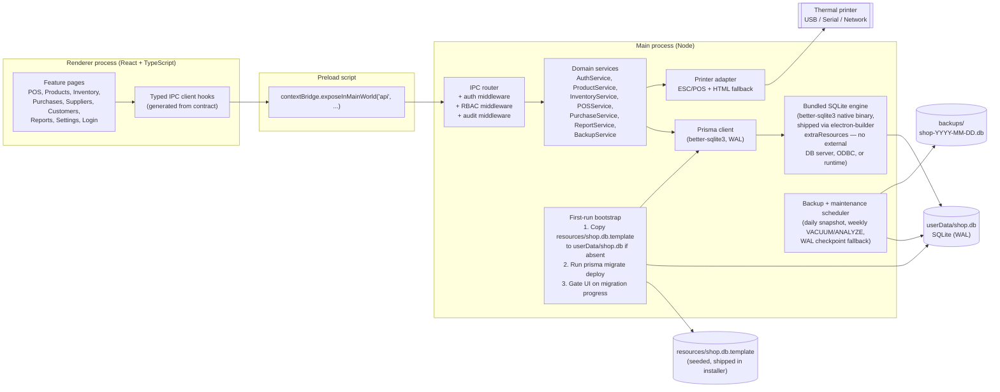
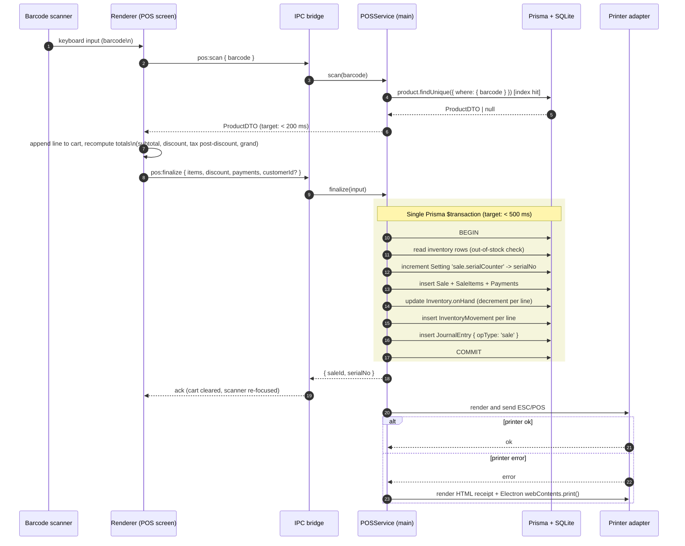
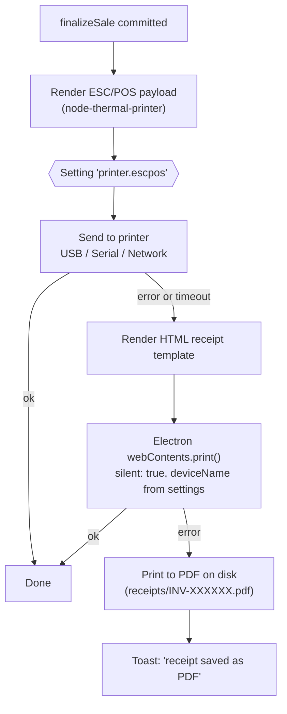
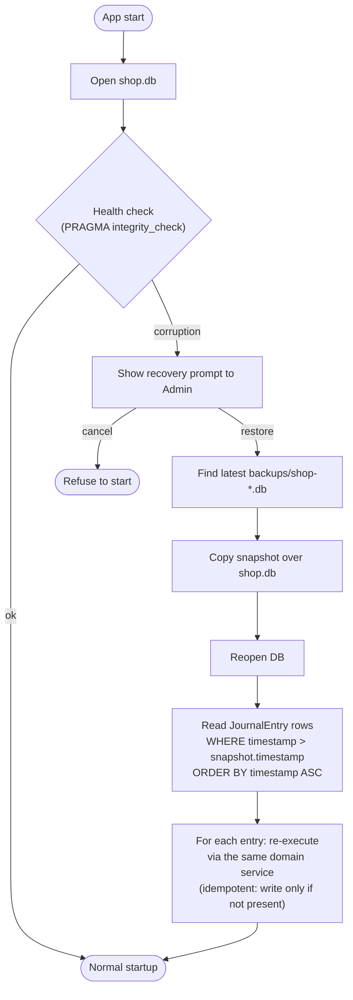

# Design Document

## Overview

Core Retail ERP V1 is a single-tenant, offline-first desktop application packaged as an Electron installer. The renderer process hosts a React + TypeScript UI; the main process owns all business logic, the SQLite database (accessed through Prisma), and integration with hardware (receipt printer) and the file system (backups). The renderer has no direct database access. Every cross-process call goes through a typed IPC contract.

The system is built around four architectural decisions that everything else hangs from:

1. **Single writer.** Only the main process opens the SQLite database. The renderer talks to the main process exclusively through IPC. This eliminates a class of concurrency and data-corruption bugs that would otherwise need defensive code.
2. **One transaction per business operation.** Sales and purchases each commit as one Prisma `$transaction`. Inventory ledger writes, sale/purchase rows, payments, and journal entries live inside that same transaction. There is no path that writes a movement without writing its parent, or vice versa.
3. **Ledger-of-record for inventory.** `inventory_movements` is the source of truth for stock. The denormalized `inventory.on_hand` is a cache that must equal the sum of deltas at every commit boundary. This invariant is enforced inside the transaction and validated in tests (Property 1).
4. **Append-only journals.** `journal_entries` and `audit_logs` are written but never updated or deleted by any code path. Recovery is "restore latest snapshot, replay journal forward."

This document maps each requirement in `requirements.md` to a concrete component, schema element, transaction boundary, or test, and ends with the formal correctness properties that drive the property-based test suite.

## Architecture

### High-level architecture

The application is split into three layers: the Electron main process (Node, full system access), the renderer process (Chromium, sandboxed), and a shared types package consumed by both. Prisma runs only in the main process.



The renderer never imports Prisma. The preload script exposes a narrow `window.api` whose methods all return `Promise<Result<T>>` types declared in `src/shared/ipc-contract.ts`. The IPC router in main looks up the handler, runs auth check, RBAC check, then invokes the domain service.

The SQLite engine itself ships inside the Electron installer as a native `better-sqlite3` binary loaded by the main process — there is no separate DB server and no ODBC layer. On first launch a bootstrap step copies the seeded template, then runs Prisma migrations before any feature module is reachable. See "Self-Contained Installation" for details.

**Validates: Requirements 1, 8, 11, 14, 15, 16**

### Process and IPC contract

The IPC contract is a single TypeScript object literal mapping channel name → request and response types. Both sides import the same type. The renderer cannot add a channel without changing main; main cannot return a different shape without breaking the renderer build.

### List channel pagination contract (Req 16.1, 16.2, 16.3)

Every list channel — without exception — has the same envelope shape so the renderer can drive any table from one generic data hook:

```typescript
// src/shared/ipc-contract.ts
export type ListRequest<F, S extends string> = {
  filter?: F; // typed per channel (e.g. { categoryId?, lowStockOnly? })
  search?: string; // server-side LIKE / FTS, normalized in main
  sort?: { key: S; dir: 'asc' | 'desc' };
  cursor?: string; // base64(JSON({ ts: ISOString, id: string })); omitted on first page
  pageSize?: number; // default 50, hard max 200; main clamps both
  withCount?: boolean; // opt-in COUNT(*); see total-count tradeoff below
};

export type ListResponse<T> = {
  rows: T[]; // length <= pageSize
  nextCursor: string | null; // null when the page completes the result set
  totalCount?: number; // present iff request had withCount: true
};
```

The cursor is `base64(JSON({ ts, id }))` where `ts` is the ISO timestamp of the row's sort column (`created_at` for sales, `timestamp` for journal/movements/audit) and `id` is the row's primary key. The cursor is opaque to the renderer; tampering is not a concern (every list is RBAC-gated and any malformed cursor is rejected with `VALIDATION`).

Total count is opt-in because `SELECT COUNT(*)` on SQLite is `O(N)` even on indexed columns (SQLite does not maintain row counts in btree metadata). Pages omit it by default; UIs that need a total page through a separate `count` channel or set `withCount: true` once and cache the result client-side.

```typescript
// src/shared/ipc-contract.ts
export type IpcContract = {
  'auth:login': {
    req: { username: string; password: string };
    res: { sessionId: string; role: 'Admin' | 'Cashier' };
  };
  'auth:logout': { req: void; res: void };

  // Paginated list channels — uniform ListRequest / ListResponse shape.
  'products:list': {
    req: ListRequest<{ categoryId?: string; lowStockOnly?: boolean }, 'name' | 'sku' | 'createdAt'>;
    res: ListResponse<ProductDTO>;
  };
  'products:upsert': { req: ProductInput; res: ProductDTO };
  'customers:list': {
    req: ListRequest<{ phonePrefix?: string }, 'name' | 'createdAt'>;
    res: ListResponse<CustomerDTO>;
  };
  'suppliers:list': { req: ListRequest<{}, 'name'>; res: ListResponse<SupplierDTO> };
  'sales:list': {
    req: ListRequest<
      { cashierId?: string; customerId?: string; dateFrom?: string; dateTo?: string },
      'createdAt' | 'serialNo'
    >;
    res: ListResponse<SaleSummaryDTO>;
  };
  'purchases:list': {
    req: ListRequest<{ supplierId?: string; dateFrom?: string; dateTo?: string }, 'createdAt'>;
    res: ListResponse<PurchaseSummaryDTO>;
  };
  'inventory_movements:list': {
    req: ListRequest<
      { productId?: string; movementType?: string; dateFrom?: string; dateTo?: string },
      'timestamp'
    >;
    res: ListResponse<InventoryMovementDTO>;
  };
  'audit:list': {
    req: ListRequest<
      { actionType?: string; userId?: string; dateFrom?: string; dateTo?: string },
      'timestamp'
    >;
    res: ListResponse<AuditLogDTO>;
  };
  'journal_entries:list': {
    req: ListRequest<{ opType?: string; dateFrom?: string; dateTo?: string }, 'timestamp'>;
    res: ListResponse<JournalEntryDTO>;
  }; // Admin debug only

  // Optional companion count channels for views that need a totals strip.
  'sales:count': { req: { filter?: SalesFilter }; res: { totalCount: number } };
  'inventory_movements:count': { req: { filter?: MovementFilter }; res: { totalCount: number } };

  // POS, purchases, inventory, reports, backup.
  'pos:scan': { req: { barcode: string }; res: ProductDTO | null };
  'pos:finalize': { req: FinalizeSaleInput; res: { saleId: string; serialNo: string } };
  'purchase:create': { req: PurchaseInput; res: { purchaseId: string } };
  'inventory:adjust': { req: AdjustmentInput; res: { movementId: string } };
  'reports:dailySales': { req: { date: string }; res: DailySalesReport };
  'reports:export': {
    req: { reportId: string; format: 'csv' | 'pdf'; filter?: unknown; sort?: unknown };
    res: { path: string; rowCount: number };
  };
  // Streams: main process opens a write stream, drives a cursor-paginated
  // SELECT in batches of pageSize internally, and pipes rows through
  // papaparse.unparse / pdfkit so memory use stays bounded (Property 17).
  'backup:now': { req: void; res: { path: string } };
  'backup:restore': { req: { path: string }; res: void };
  // ... etc
};
```

Every handler runs through the same middleware stack:

```typescript
// src/main/ipc/router.ts (sketch)
ipcMain.handle(channel, async (_e, payload) => {
  const session = sessionStore.get(_e.sender); // auth
  if (handler.requiresAuth && !session) return Err('UNAUTHENTICATED');
  if (!Permission.allows(session.role, channel))
    // RBAC
    return Err('FORBIDDEN', { auditDenial: true });
  return handler.run(payload, { session });
});
```

**Validates: Requirements 1.5, 8.1–8.4, 16.1, 16.2, 16.3**

## Components and Interfaces

### Module breakdown

Each module has (a) a domain service in `src/main/services/`, (b) a feature folder in `src/renderer/features/`, and (c) IPC channels declared in the shared contract.

| Module              | Backend service (`src/main/services/`)                | Renderer feature (`src/renderer/features/`) | Primary requirements |
| ------------------- | ----------------------------------------------------- | ------------------------------------------- | -------------------- |
| Auth                | `auth.service.ts` (bcrypt, session map)               | `login/`, `setup/`                          | Req 1                |
| Products            | `product.service.ts`                                  | `products/`                                 | Req 2                |
| Categories          | inside `product.service.ts`                           | inside `products/`                          | Req 2.5              |
| Inventory           | `inventory.service.ts` (ledger writer, on-hand cache) | `inventory/`, low-stock banner              | Req 3, 11.4          |
| POS                 | `pos.service.ts` (cart not persisted; finalize tx)    | `pos/` (single screen)                      | Req 4, 12, 14.3      |
| Purchases           | `purchase.service.ts`                                 | `purchases/`                                | Req 5                |
| Suppliers           | `supplier.service.ts`                                 | `suppliers/`                                | Req 6                |
| Customers           | `customer.service.ts`                                 | `customers/`                                | Req 7                |
| Roles & Permissions | `permission.service.ts` (RBAC matrix)                 | `users/`, role-gated routes                 | Req 8, 13.2          |
| Reports             | `report.service.ts` (aggregations + exporters)        | `reports/`                                  | Req 9                |
| Backup              | `backup.service.ts` (scheduler, snapshot, retention)  | `backup/` panel in settings                 | Req 10, 11.3         |
| Audit               | `audit.service.ts` (append-only writer)               | viewable list under settings                | Req 13               |

The cart in POS is renderer-only state until finalize. Finalize sends the entire cart as one IPC payload; the main process is the only place a sale becomes durable.

**Validates: Requirements 1–10, 13**

## Data Models

### Prisma schema

The schema below covers every required table from Req 15.1 and the FK pairs from Req 15.2. SQLite is configured with `journal_mode = WAL` and `foreign_keys = ON`.

```prisma
// prisma/schema.prisma
datasource db { provider = "sqlite"; url = env("DATABASE_URL") }
generator client { provider = "prisma-client-js" }

model Role {
  id       String  @id @default(cuid())
  name     String  @unique           // 'Admin' | 'Cashier'
  users    User[]
}

model User {
  id           String   @id @default(cuid())
  username     String   @unique
  passwordHash String
  roleId       String
  role         Role     @relation(fields: [roleId], references: [id])
  createdAt    DateTime @default(now())
  saleEvents   Sale[]   @relation("CashierSales")
  movements    InventoryMovement[]
}

model Category {
  id       String    @id @default(cuid())
  name     String    @unique
  products Product[]
}

model Product {
  id             String   @id @default(cuid())
  sku            String   @unique
  name           String
  categoryId     String
  category       Category @relation(fields: [categoryId], references: [id])
  barcode        String?  @unique
  buyPrice       Decimal
  sellPrice      Decimal
  taxRate        Decimal  @default(0)        // e.g. 0.18
  warrantyMonths Int      @default(0)
  reorderLevel   Int      @default(0)
  inventory      Inventory?
  saleItems      SaleItem[]
  purchaseItems  PurchaseItem[]
  movements      InventoryMovement[]
  @@index([barcode])
  @@index([sku])
}

model Inventory {
  productId String  @id
  product   Product @relation(fields: [productId], references: [id])
  onHand    Int     @default(0)              // denormalized cache; invariant: == sum(movements.qtyDelta)
  updatedAt DateTime @updatedAt
}

model InventoryMovement {
  id            String   @id @default(cuid())
  productId     String
  product       Product  @relation(fields: [productId], references: [id])
  quantityDelta Int                                       // +N for receipt/return, -N for sale
  movementType  String                                    // 'sale' | 'purchase' | 'adjustment' | 'return'
  referenceType String                                    // 'sale' | 'purchase' | 'adjustment'
  referenceId   String
  userId        String
  user          User     @relation(fields: [userId], references: [id])
  timestamp     DateTime @default(now())
  @@index([productId])
  @@index([referenceType, referenceId])
  @@index([timestamp])
  @@index([timestamp(sort: Desc), id])                    // cursor index for paginated movement list (Req 15.4, 16.4)
}

model Customer {
  id        String  @id @default(cuid())
  name      String
  phone     String?
  sales     Sale[]
  createdAt DateTime @default(now())
  @@index([phone])
}

model Supplier {
  id        String     @id @default(cuid())
  name      String
  phone     String?
  address   String?
  purchases Purchase[]
  @@index([name])
}

model Purchase {
  id           String         @id @default(cuid())
  supplierId   String
  supplier     Supplier       @relation(fields: [supplierId], references: [id])
  invoiceNo    String?
  total        Decimal
  createdAt    DateTime       @default(now())
  items        PurchaseItem[]
  @@index([supplierId, createdAt])
}

model PurchaseItem {
  id           String   @id @default(cuid())
  purchaseId   String
  purchase     Purchase @relation(fields: [purchaseId], references: [id], onDelete: Restrict)
  productId    String
  product      Product  @relation(fields: [productId], references: [id])
  quantity     Int
  unitBuyPrice Decimal
  lineTotal    Decimal                       // == quantity * unitBuyPrice (Property: line_total identity)
  @@index([purchaseId])
}

model Sale {
  id          String     @id @default(cuid())
  serialNo    String     @unique             // 'INV-000123'
  customerId  String?
  customer    Customer?  @relation(fields: [customerId], references: [id])
  cashierId   String
  cashier     User       @relation("CashierSales", fields: [cashierId], references: [id])
  subtotal    Decimal
  discount    Decimal    @default(0)
  taxTotal    Decimal    @default(0)
  grandTotal  Decimal
  createdAt   DateTime   @default(now())
  items       SaleItem[]
  payments    Payment[]
  @@index([serialNo])
  @@index([createdAt])
  @@index([customerId])
  @@index([createdAt(sort: Desc), id])      // cursor index for paginated sales list (Req 15.4, 16.4)
}

model SaleItem {
  id          String  @id @default(cuid())
  saleId      String
  sale        Sale    @relation(fields: [saleId], references: [id], onDelete: Restrict)
  productId   String
  product     Product @relation(fields: [productId], references: [id])
  quantity    Int
  unitPrice   Decimal                         // sellPrice at sale time
  taxRate     Decimal                         // taxRate at sale time
  lineTotal   Decimal                         // quantity * unitPrice (pre-discount, pre-tax)
  @@index([saleId])
}

model Payment {
  id      String  @id @default(cuid())
  saleId  String
  sale    Sale    @relation(fields: [saleId], references: [id], onDelete: Restrict)
  method  String                              // 'cash' | 'card' | 'mobile'
  amount  Decimal
  @@index([saleId])
}

model Setting {
  key   String @id
  value String                                 // JSON string
}
// Notable keys:
//   'sale.serialCounter'  -> integer string, monotonic counter for INV-XXXXXX
//   'printer.escpos'      -> { kind: 'usb'|'serial'|'network', target: string }
//   'backup.retentionDays'-> '14'
//   'backup.lastSnapshot' -> ISO timestamp

model AuditLog {
  id         String   @id @default(cuid())
  actionType String                           // 'price.change' | 'role.change' | 'stock.adjust' | 'rbac.deny' ...
  entityType String
  entityId   String
  previous   String?                          // JSON
  next       String?                          // JSON
  userId     String?
  timestamp  DateTime @default(now())
  @@index([timestamp])
  @@index([actionType])
  @@index([timestamp(sort: Desc), id])        // cursor index for paginated audit list (Req 15.4, 16.4)
}

model JournalEntry {
  id        String   @id @default(cuid())
  opType    String                            // 'sale' | 'purchase' | 'adjustment' | 'price.change' | 'role.change'
  payload   String                            // JSON snapshot of the committed business event
  timestamp DateTime @default(now())
  @@index([timestamp])
  @@index([timestamp(sort: Desc), id])        // cursor index for replay window + paginated debug list (Req 15.4, 16.4)
}
```

### Index summary and additions for Req 15.4, 16.4

The schema's required indexes fall into two groups: single-column indexes for filter/lookup columns, and composite `(timestamp DESC, id)` / `(createdAt DESC, id)` indexes that back cursor pagination on the four high-growth append-mostly tables.

Single-column indexes (already present, listed for traceability):

- `Product.sku` (unique), `Product.barcode` (unique) — fast scan and lookup (Req 4.1, Req 12.1, Req 16.4).
- `Customer.phone` — customer lookup (Req 16.4).
- `Supplier.name` — supplier directory sort key (Req 16.4).
- `Sale.serialNo`, `Sale.createdAt`, `Sale.customerId` — receipt lookup and per-customer history (Req 4.3, Req 16.4).
- `InventoryMovement.productId`, `InventoryMovement.timestamp` — ledger reconciliation and chronological browse (Req 11.4, Req 16.4).
- `JournalEntry.timestamp` — replay window selection during recovery (Req 10.6, Req 16.4).
- `AuditLog.timestamp`, `AuditLog.actionType` — audit browsing and filtering (Req 13, Req 16.4).

Composite cursor indexes added in this revision (Req 15.4):

- `Sale @@index([createdAt(sort: Desc), id])`
- `InventoryMovement @@index([timestamp(sort: Desc), id])`
- `AuditLog @@index([timestamp(sort: Desc), id])`
- `JournalEntry @@index([timestamp(sort: Desc), id])`

Each composite index lets a query of the form `WHERE (created_at, id) < (?, ?) ORDER BY created_at DESC, id DESC LIMIT ?` resolve as an indexed seek + bounded scan rather than a full sort, which is what enables the p95 < 100 ms first-page target on a 1M-row table (Req 16.9, Property 16).

FK constraints required by Req 15.2 are all declared via Prisma `@relation`. SQLite enforces them once `PRAGMA foreign_keys = ON` is set on each connection.

**Validates: Requirements 2, 3, 4, 5, 6, 7, 10, 13, 15, 16.4**

## Atomicity Strategy

Every business mutation that touches inventory commits inside one Prisma `$transaction`. The transaction body is a pure function of its inputs; the printer call and IPC reply happen _after_ commit so a printer failure never rolls back stock.

### SQLite configuration

On startup the main process runs the following `PRAGMA` statements on the Prisma connection:

```sql
PRAGMA journal_mode = WAL;        -- crash-safe writes; readers don't block writer
PRAGMA synchronous  = NORMAL;     -- WAL-safe; durability at COMMIT/checkpoint
PRAGMA foreign_keys = ON;         -- enforce FKs from Req 15.2
PRAGMA busy_timeout = 5000;       -- avoid spurious SQLITE_BUSY under printer/scheduler contention
```

WAL mode is the rationale for why backup snapshots are taken with the `VACUUM INTO` command (which produces a consistent copy without stopping writers) rather than file copy.

### Sale finalize transaction

```typescript
// src/main/services/pos.service.ts
async function finalizeSale(input: FinalizeSaleInput, ctx: Ctx) {
  validateTotalsIdentity(input); // subtotal - discount + tax == grandTotal == sum(payments)

  return prisma.$transaction(async (tx) => {
    // 1. Re-read on-hand inside the tx; reject if any line would go negative.
    for (const line of input.items) {
      const inv = await tx.inventory.findUniqueOrThrow({ where: { productId: line.productId } });
      if (inv.onHand - line.quantity < 0) throw new OutOfStockError(line.productId);
    }

    // 2. Allocate the next serial number atomically inside the tx.
    const serialNo = await nextSerial(tx); // updates Setting 'sale.serialCounter' inside tx

    // 3. Create sale + items + payments.
    const sale = await tx.sale.create({
      data: {
        serialNo,
        customerId: input.customerId ?? null,
        cashierId: ctx.session.userId,
        subtotal: input.subtotal,
        discount: input.discount,
        taxTotal: input.taxTotal,
        grandTotal: input.grandTotal,
        items: { create: input.items.map(toSaleItem) },
        payments: { create: input.payments.map(toPayment) },
      },
      include: { items: true, payments: true },
    });

    // 4. Decrement inventory + append exactly one movement per line.
    for (const line of sale.items) {
      await tx.inventory.update({
        where: { productId: line.productId },
        data: { onHand: { decrement: line.quantity } },
      });
      await tx.inventoryMovement.create({
        data: {
          productId: line.productId,
          quantityDelta: -line.quantity,
          movementType: 'sale',
          referenceType: 'sale',
          referenceId: sale.id,
          userId: ctx.session.userId,
        },
      });
    }

    // 5. Append the journal entry (last write inside the tx).
    await tx.journalEntry.create({
      data: { opType: 'sale', payload: JSON.stringify(serializeSale(sale)) },
    });

    return { sale, serialNo };
  });
  // Printing happens AFTER commit; print failure -> HTML fallback, never rollback.
}
```

The same shape applies to `purchase.service.ts` (increment instead of decrement, no out-of-stock check) and `inventory.service.ts#adjust` (single line, audit log inside the tx).

### Why the out-of-stock check is inside the tx

If the read happened before `$transaction`, two cashiers selling the last unit could both pass the check and both commit (Req 3.7 violated). Reading inside the tx, with WAL + the unique constraint on `Inventory.productId`, serializes the writes; one will see the decremented value and reject with `OutOfStockError`.

### What happens on crash mid-transaction

SQLite's WAL guarantees that any transaction not committed at the time of crash is invisible after restart. The Prisma client opens the database in WAL mode on the next launch and reads only committed pages. There is no application-level recovery for an interrupted sale — it simply never happened. This is the basis for Property 6.

**Validates: Requirements 3.3, 3.4, 3.7, 4.2, 4.9, 5.1, 5.5, 11.1, 11.2, 11.3**

## Inventory Ledger Invariant

The inventory ledger invariant is: for every product `p`,

```
inventory.onHand(p) == sum(inventoryMovement.quantityDelta where productId = p)
```

This invariant is enforced at three points:

1. **At write time**, by the transaction structure: every `inventory.update` of `onHand` is paired with exactly one `inventoryMovement.create` of equal magnitude inside the same `$transaction`. There is no service method that updates `onHand` without also writing a movement.
2. **At read time, in dev/test builds**, by an optional `assertInvariant()` helper that runs after each transaction in test mode and computes both sides for every touched product.
3. **At rest**, by the property test suite (Property 1), which generates random op sequences and asserts the invariant after each commit.

`onHand` exists as a denormalized cache only because recomputing the sum on every barcode scan would not meet the 200ms target with large movement histories (Req 4.1, Req 12.1). The invariant is what lets us use the cache safely.

**Validates: Requirements 3.2, 11.4**

## POS Flow



### Key details

- **Cart is renderer-only.** The cart is React state. Nothing about a sale exists in the database until `pos:finalize` is called. This is what makes the 200ms scan target achievable: scan is just a `findUnique` on an indexed column.
- **Tax computed on post-discount subtotal.** The renderer computes totals as it builds the cart and the main process re-validates them inside the transaction:
  ```
  subtotal       = sum(line.quantity * line.unitPrice)
  discountAmount = if percentage then subtotal * pct else fixedAmount
  taxableBase    = subtotal - discountAmount
  taxTotal       = sum( ((line.quantity * line.unitPrice) * (1 - discountAmount/subtotal)) * line.taxRate )
  grandTotal     = taxableBase + taxTotal
  ```
  Discount is allocated proportionally across lines so per-line tax can be computed deterministically. `validateTotalsIdentity` rejects the finalize if the renderer's numbers don't match the recomputation (Property 2).
- **Split payments.** `payments[]` is a list. Validation rejects if `sum(payments.amount) != grandTotal`.
- **Serial number allocation.** A row in `Setting` with key `sale.serialCounter` holds the next integer. Inside the finalize transaction:
  ```typescript
  async function nextSerial(tx) {
    const row = await tx.setting.findUniqueOrThrow({ where: { key: 'sale.serialCounter' } });
    const next = (parseInt(row.value, 10) + 1).toString();
    await tx.setting.update({ where: { key: 'sale.serialCounter' }, data: { value: next } });
    return `INV-${next.padStart(6, '0')}`;
  }
  ```
  Because the read-modify-write happens inside the same `$transaction`, two concurrent finalizes serialize on the row update; the second sees the first's commit and produces the next number. This gives strict monotonicity and uniqueness (Property 4). `Sale.serialNo` is also `@unique`, which is a backstop.
- **Print after commit.** The receipt print is intentionally outside the transaction. A jammed printer never causes lost sales; it falls through to the HTML fallback path.

**Validates: Requirements 4.1–4.9, 12.1, 12.2**

## Receipt Printing Pipeline



### Configuration

The `Setting` row `printer.escpos` holds a JSON value: `{ kind: 'usb' | 'serial' | 'network', target: string }`. The settings UI (Admin only, Req 8.2) lets the Admin pick the connection kind and target (e.g. `/dev/usb/lp0`, `192.168.1.50:9100`).

### Adapter contract

```typescript
// src/main/printing/printer.ts
export interface PrinterAdapter {
  print(receipt: ReceiptDTO): Promise<void>; // throws on hardware failure
}

export function selectPrinter(): PrinterAdapter {
  return new ChainAdapter([
    new EscPosAdapter(loadEscPosConfig()), // primary
    new HtmlAdapter(), // Electron webContents.print()
    new PdfAdapter(), // last-resort, file on disk
  ]);
}
```

`ChainAdapter.print` tries each in order; the first that succeeds wins. Only the chain is exposed to the rest of the app, so callers never need to know which path actually printed.

**Validates: Requirements 4.7, 4.8, 14.4**

## Backup and Journal

Two cooperating mechanisms protect data: snapshot files and the append-only journal table.

### Snapshot model

Snapshots live in `<userData>/backups/shop-YYYY-MM-DD.db`, produced by `VACUUM INTO`. `VACUUM INTO` works while the database is open and produces a fully consistent copy.

### Scheduling

Electron has no cron; the brief calls for "setInterval check on launch + idle". Implementation:

```typescript
// src/main/services/backup.service.ts
function startScheduler() {
  // 1. On every launch, if today has no snapshot, take one.
  if (lastSnapshotDate() < today()) takeSnapshot();

  // 2. Re-check every 30 minutes while the app is running.
  setInterval(
    () => {
      if (lastSnapshotDate() < today()) takeSnapshot();
    },
    30 * 60 * 1000,
  );

  // 3. Manual trigger.
  registerIpc('backup:now', () => takeSnapshot());

  // 4. Weekly VACUUM + ANALYZE maintenance window (Req 16.10).
  //    Default: Sundays 03:00 local time. Configurable via Setting 'maintenance.cron'.
  scheduleMaintenance(loadCron('maintenance.cron') ?? '0 3 * * 0');

  // 5. WAL checkpoint fallback (Req 16.11).
  setInterval(() => prisma.$executeRawUnsafe(`PRAGMA wal_checkpoint(PASSIVE)`), 60 * 60 * 1000);
}
```

`VACUUM INTO` (used for snapshots) and the weekly `VACUUM` are SQLite-level streaming operations: they walk pages, never the whole DB-as-buffer (Req 16.7). The weekly job briefly takes an exclusive lock; that is why it runs outside business hours and is documented as such in the settings UI.

WAL checkpoint policy (Req 16.11): the Prisma client opens the DB with `PRAGMA wal_autocheckpoint = 1000` so SQLite passively checkpoints every 1000 committed pages. The 60-minute `setInterval` above is a fallback for low-write idle periods so the WAL file does not grow unbounded if the page-count threshold is never hit. `TRUNCATE` checkpoints (which compact the WAL file to zero bytes) are deferred to the weekly maintenance window because they require a brief exclusive lock; `PASSIVE` is used during business hours so cashiers are never blocked.

### Retention

After every snapshot, `enforceRetention()` keeps the 14 most recent files in `backups/` and deletes the rest. The retention count is stored in `Setting` `backup.retentionDays`, default `14` (Req 10.3).

### Journal entries

Inside every business transaction, the last operation is `tx.journalEntry.create(...)`. The payload is a JSON serialization of the committed event sufficient to replay it: for a sale, the entire `Sale + items + payments`; for a purchase, the entire `Purchase + items`; for an adjustment or price change, the before/after values.

The journal is append-only. There is no service method that calls `prisma.journalEntry.update` or `prisma.journalEntry.delete`; this is enforced by Property 5 (a static check in the test suite that no such call exists in `src/`).

### Recovery flow



The replay step uses the same domain services that wrote the entries originally, so any invariant they enforce (atomicity, ledger identity, audit) remains enforced during recovery. Replay is idempotent: each journal entry carries the original `referenceId`, and replay services skip if a row with that id already exists.

### Batched, memory-bounded replay (Req 16.8)

Replay reads journal entries in batches of at most 1000 rows ordered by `timestamp ASC`, using cursor pagination on the same `(timestamp DESC, id)` index used by the debug list (the read direction is reversed for replay; the index serves both):

```typescript
// src/main/services/backup.service.ts (sketch)
async function replayJournal(snapshotTs: Date) {
  let cursor: { ts: Date; id: string } | null = { ts: snapshotTs, id: '' };
  while (cursor) {
    const batch = await prisma.journalEntry.findMany({
      where: {
        OR: [{ timestamp: { gt: cursor.ts } }, { timestamp: cursor.ts, id: { gt: cursor.id } }],
      },
      orderBy: [{ timestamp: 'asc' }, { id: 'asc' }],
      take: 1000,
    });
    if (batch.length === 0) break;

    // Each batch is one Prisma $transaction; idempotent per entry.
    await prisma.$transaction(async (tx) => {
      for (const entry of batch) await replayEntry(tx, entry);
    });

    const last = batch[batch.length - 1];
    cursor = { ts: last.timestamp, id: last.id };
  }
}
```

`replayEntry` is idempotent by construction: it computes the deterministic primary key (`Sale.id`, `Purchase.id`, `InventoryMovement.id`) from the journal payload and uses Prisma `upsert` with the original `referenceId`; if the row is already present from a prior partial replay, the upsert is a no-op and inventory deltas are skipped.

This makes the replay itself crash-safe (Property 6 extension): killing the process mid-replay leaves at most one in-flight 1000-row batch un-applied; on the next launch the same cursor walk resumes, idempotent upserts skip the entries already committed, and the database converges to the same final state.

**Validates: Requirements 10.1–10.6, 11.3, 16.7, 16.8, 16.10, 16.11**

## Auth and RBAC

### Password hashing

`bcrypt` with a cost factor of 12. Hashes are stored in `User.passwordHash`. The `auth:login` handler is the only code path that calls `bcrypt.compare`. There is no path that reads or returns `passwordHash` to the renderer (Req 1.3).

### Session model

Sessions live in a `Map<senderId, Session>` in main process memory. They are not persisted to disk; closing the app terminates all sessions (Req 1.4). The session record carries `{ userId, role, sessionId, createdAt }`.

### RBAC matrix

A static map declares which role may invoke which IPC channel:

```typescript
// src/main/permission/matrix.ts
const RBAC: Record<keyof IpcContract, Role[]> = {
  'auth:login': ['Admin', 'Cashier'],
  'auth:logout': ['Admin', 'Cashier'],
  'products:list': ['Admin', 'Cashier'],
  'products:upsert': ['Admin'],
  'pos:scan': ['Admin', 'Cashier'],
  'pos:finalize': ['Admin', 'Cashier'],
  'purchase:create': ['Admin'],
  'inventory:adjust': ['Admin'],
  'reports:dailySales': ['Admin'],
  'reports:export': ['Admin'],
  'backup:now': ['Admin'],
  'backup:restore': ['Admin'],
  // ...
};
```

The IPC router consults this map before invoking the handler. A denied call returns `Err('FORBIDDEN')` and emits an `audit_logs` row of type `rbac.deny`.

### Audit middleware

Sensitive operations (price change, role change, manual stock adjustment, RBAC denial) are wrapped by an audit decorator that runs inside the same transaction as the operation it audits. The audit row carries `previous`, `next`, `userId`, and `timestamp` (Req 13.1–13.4).

**Validates: Requirements 1.1–1.6, 8.1–8.5, 13.1–13.4**

## Error Handling

Errors fall into a small number of categories, each with a defined surface and behavior.

### Error taxonomy

| Category           | Origin                                             | Surface to renderer                       | Persistence                          |
| ------------------ | -------------------------------------------------- | ----------------------------------------- | ------------------------------------ |
| `VALIDATION`       | input shape, totals identity, payment sum mismatch | inline form error + toast                 | none                                 |
| `OUT_OF_STOCK`     | inventory check inside finalize tx                 | toast + per-line marker on the cart row   | none (tx rolled back)                |
| `UNIQUE_VIOLATION` | sku/barcode/serialNo clash                         | inline form error                         | none                                 |
| `FK_VIOLATION`     | bad supplier/customer/category id                  | inline form error                         | none                                 |
| `UNAUTHENTICATED`  | IPC call with no session                           | redirect to login                         | none                                 |
| `FORBIDDEN`        | RBAC matrix denial                                 | toast + log entry visible to Admin        | `audit_logs` row of type `rbac.deny` |
| `PRINTER_FAILURE`  | ESC/POS adapter throws or times out                | silent — caller falls through to HTML/PDF | none (sale already committed)        |
| `DB_INTEGRITY`     | `PRAGMA integrity_check` fails on startup          | recovery prompt                           | recovery flow takes over             |
| `INTERNAL`         | unexpected throw inside a service                  | toast with error id; details in logs only | log file                             |

### Result envelope

Every IPC handler returns `Result<T, ErrorEnvelope>`:

```typescript
// src/shared/result.ts
export type Result<T, E = ErrorEnvelope> = { ok: true; value: T } | { ok: false; error: E };

export type ErrorEnvelope = {
  code:
    | 'VALIDATION'
    | 'OUT_OF_STOCK'
    | 'UNIQUE_VIOLATION'
    | 'FK_VIOLATION'
    | 'UNAUTHENTICATED'
    | 'FORBIDDEN'
    | 'PRINTER_FAILURE'
    | 'DB_INTEGRITY'
    | 'INTERNAL';
  message: string;
  details?: Record<string, unknown>;
  errorId?: string; // correlation id for INTERNAL errors
};
```

The renderer never throws on IPC results; it pattern-matches `result.ok`. This keeps the renderer's error surface uniform across modules.

### Transaction failure handling

Inside `prisma.$transaction`, any thrown error rolls back the entire transaction (Property 6). Domain services translate Prisma errors into the envelope codes above:

```typescript
try { return await prisma.$transaction(...) }
catch (e) {
  if (e instanceof OutOfStockError)        return Err('OUT_OF_STOCK', { productId: e.productId });
  if (isUniqueViolation(e))                return Err('UNIQUE_VIOLATION', extractFields(e));
  if (isFkViolation(e))                    return Err('FK_VIOLATION', extractFields(e));
  log.error({ errorId, e });
  return Err('INTERNAL', { errorId });
}
```

### Printer failures never roll back sales

Printing happens after commit. A `PRINTER_FAILURE` is handled by the chain adapter, not propagated to the renderer as a sale failure. The renderer is told the sale committed (with `serialNo`) and, separately, whether the receipt printed via thermal, HTML, or fell through to PDF.

### Startup integrity check

On every launch, the main process runs `PRAGMA integrity_check`. A non-`ok` result triggers the recovery flow (see Backup and Journal). The app refuses to open `BrowserWindow` until either integrity passes or recovery completes.

**Validates: Requirements 1.2, 3.7, 4.8, 4.9, 5.5, 10.6, 11.1–11.3, 13.4, 15.2**

## UI/UX Direction

The renderer uses React + TypeScript with a small, opinionated component layer (e.g. shadcn/ui or equivalent). Layout principles:

- **Single-screen POS.** The POS screen contains: scanner-focused input at the top, cart in the middle (large rows, big fonts), totals + discount + customer attach on the right, payment panel at the bottom. Reachable in one click from the home screen (Req 14.3). The scan input keeps focus by default and re-claims it after every action so a barcode wedge scanner "just works".
- **Keyboard-first cashier flow.** Every POS action has a hotkey: `F1` add product manually, `F2` apply discount, `F3` attach customer, `F4` pay cash, `F5` pay card, `F6` pay mobile, `F9` finalize. The cashier can complete a sale without touching the mouse.
- **Large hit targets.** Cart row height ≥ 56px; payment buttons ≥ 80px tall. Optimized for touch and stress.
- **Low-stock banner.** A persistent banner component reads from `inventory:lowStockCount` and shows on every screen when count > 0; clicking opens the low-stock report (Req 3.6, Req 9.3).
- **Admin dashboard.** Home screen for Admins shows today's sales total, today's transaction count, low-stock count, and quick links. Cashier home goes straight to POS.
- **Error display.** Out-of-stock and FK errors surface as toast + inline message on the offending cart line; finalize stays disabled until resolved.

**Validates: Requirements 3.6, 4, 14.2, 14.3**

## Reports Module

Reports are computed on demand by SQL aggregation queries through Prisma. There are no materialized views in V1; query times on a single-shop dataset are well under interactive thresholds. If a future report exceeds budget, that report — not the framework — gets an aggregation cache.

### Query shapes

```typescript
// Daily sales
await prisma.sale.aggregate({
  where: { createdAt: { gte: startOfDay, lt: endOfDay } },
  _count: { _all: true },
  _sum: { grandTotal: true, taxTotal: true, discount: true },
});
// Per-payment-method breakdown:
await prisma.payment.groupBy({
  by: ['method'],
  where: { sale: { createdAt: { gte: startOfDay, lt: endOfDay } } },
  _sum: { amount: true },
});
```

### Export

CSV and PDF exports run as streaming pipelines so the 1M-row dataset case in Req 16.6 fits inside the 200 MB Process_RSS budget (Property 17). The renderer triggers `reports:export`, which:

1. Opens the destination file via Electron's `dialog.showSaveDialog` (one user gesture, two output paths if the renderer asks for both formats).
2. Drives the underlying SELECT in the main process as a cursor-paginated query — same `(created_at DESC, id)` or `(timestamp DESC, id)` cursor shape used by `*:list` channels — pulling at most `pageSize` rows into memory at any one time.
3. Pipes each batch through the format-specific encoder:
   - **CSV:** `papaparse.unparse(batch, { header: i === 0 })` written line-by-line into a Node `WriteStream`. The header is emitted on the first batch only.
   - **PDF:** `pdfkit` in streaming mode — `doc.pipe(fs.createWriteStream(path))` — appending rows page by page; `doc.addPage()` is called as the current page fills, and finished pages are flushed by pdfkit immediately so memory does not grow with row count.
4. Returns `{ path, rowCount }` only after the encoder's `finish` event fires.

The export contract (Req 9.5) is: for any report, calling `reports:export` produces both a CSV file and a PDF file of the same data. The renderer triggers both in one IPC and gets back two paths. Because both encoders sit behind the same cursor-paginated SELECT, doubling the output formats does not double the memory footprint — the row buffer is shared and disposed per batch.

**Validates: Requirements 9.1–9.5, 16.3, 16.6**

## Large-Database Strategy

The application is expected to live for years on a single workstation. By year three the `sales`, `inventory_movements`, `audit_logs`, and `journal_entries` tables can each cross a million rows. This section is the contract every list, export, backup, and recovery code path follows so the application stays interactive at that scale (Req 12.4, Req 16). It is cross-cutting by design: Architecture's IPC contract, Data Models' indexes, Reports' export, Backup's snapshot and replay, and the renderer's table components all participate.

### 1. Pagination contract (Req 16.1, 16.2, 16.3)

Every list channel returns the envelope defined under "List channel pagination contract":

```typescript
{ rows: T[], nextCursor: string | null, totalCount?: number }
```

Defaults and limits:

- Default `pageSize` is **50**. Hard maximum is **200**; any larger value is clamped server-side.
- The cursor is `base64(JSON({ ts, id }))` — i.e. the `(sort-column, primary-key)` pair of the last row on the page. Decoding is one `JSON.parse` of a short string and validates that `ts` parses as ISO and `id` is a string. There is no signing or HMAC; tampering is not a security concern (RBAC gates the channel and bad cursors are rejected with `VALIDATION`).
- `nextCursor` is `null` exactly when the page completes the result set (`rows.length < pageSize`).
- `totalCount` is omitted unless the request sets `withCount: true`. Pagination must work without ever computing a count.

**Total-count tradeoff (Req 16.2).** SQLite has no row-count metadata on a btree, so `SELECT COUNT(*)` is `O(N)` — it walks every row even on indexed columns. Computing a count on every page request would put the count cost on the hottest path, defeating the < 100 ms target. The contract therefore makes count opt-in: views that need it page through a separate `*:count` channel (or set `withCount: true` on the first page only and cache the value). The Reports module is the most common consumer; it computes counts as part of its aggregations rather than via the list channels.

### 2. Cursor-paginated SQL shape (Req 16.1, 15.4)

Every list channel resolves to one of two equivalent SQL templates, depending on sort direction. The descending-by-timestamp shape (used by sales, journal entries, inventory movements, audit logs) is:

```sql
SELECT *
FROM   <table>
WHERE  (<sort_col>, id) < (?, ?)        -- ? bound from cursor; on first page these are sentinels
ORDER  BY <sort_col> DESC, id DESC
LIMIT  ?;                                -- pageSize, clamped
```

The composite `(sort_col DESC, id)` indexes added in Data Models (Req 15.4) cover this query as an indexed range-seek + bounded scan. There is no `OFFSET`, ever — `OFFSET N` on SQLite scans and discards `N` rows, which is the failure mode at million-row scale.

The ascending shape (used by journal replay, Req 16.8) is the mirror:

```sql
SELECT *
FROM   journal_entries
WHERE  (timestamp, id) > (?, ?)
ORDER  BY timestamp ASC, id ASC
LIMIT  1000;
```

Same index, opposite walk direction.

### 3. Server-side filter, search, sort (Req 16.3)

Every list channel accepts typed `filter`, `search`, and `sort` parameters and resolves them into the SQL above before returning. The renderer never receives a full table and never filters in JS. Specifically:

- `filter` is a typed object per channel (e.g. `{ supplierId, dateFrom, dateTo }` for purchases). Each filter key maps to an indexed column or a join target with an indexed FK.
- `search` is a normalized string applied via `LIKE 'prefix%'` against the channel's primary search column (e.g. `products.name`, `customers.phone`). Full-text search is out of scope for V1; prefix LIKE on indexed columns covers cashier scenarios and stays inside the latency budget.
- `sort.key` is constrained by the channel's TypeScript type to a small set (the columns we have indexes for). A request for an unindexed sort key is rejected with `VALIDATION` rather than served slowly.

### 4. Indexes (Req 15.3, 15.4, 16.4)

The Prisma schema in Data Models declares both single-column indexes (one per filter/lookup column listed in Req 16.4) and composite cursor indexes (`(sort DESC, id)` on the four high-growth tables). The "Index summary and additions" subsection there is the authoritative list. Every column referenced by a list channel's `filter`, `search`, or `sort` has an index; that is the contract that makes Property 16's < 100 ms p95 achievable.

### 5. Renderer virtualization (Req 16.5)

Any renderer table whose underlying dataset can exceed 200 rows is rendered with row virtualization — `react-window` (or `@tanstack/react-virtual`, equivalent semantics). The bounded-DOM contract is:

> At most ~30 rows are mounted in the DOM at any time, regardless of how many rows the dataset contains or how far the user has scrolled.

This applies to the products list, customers list, suppliers list, sales history, inventory movements, audit log, journal viewer, and any report preview. Search-as-you-type debounces the server query at **250 ms** so a fast typist generates one query, not one per keystroke. Scrolling past the end of the current page transparently fetches the next page via `nextCursor`; the virtualizer treats not-yet-fetched rows as placeholders and replaces them in place when the IPC resolves.

Tables that are by construction bounded — the active POS cart, the discount panel, today's payment-method totals — render normally without virtualization.

### 6. Streaming exports (Req 16.6, Property 17)

Reports exports stream end-to-end. The pipeline is:

```
cursor-paginated SELECT  --batch of pageSize rows-->  encoder (papaparse / pdfkit)  -->  fs.WriteStream  -->  disk
```

CSV uses `papaparse.unparse(batch, { header: i === 0 })` per batch into a Node `WriteStream`. PDF uses `pdfkit`'s native streaming mode (`doc.pipe(fs.createWriteStream(path))`); finished pages are flushed by the library as `addPage()` is called, so memory does not grow with row count. Internally the SELECT walks the same `(sort DESC, id)` cursor used by the list channels — no `OFFSET`, no full materialization — so at any one time at most `pageSize` rows are resident in JS memory.

Memory budget: **Process_RSS ≤ 200 MB** while exporting a 1,000,000-row dataset. Property 17 instruments this with `process.memoryUsage()` sampled during a property-test export and asserts the bound across all generated dataset sizes.

### 7. Backup memory bound (Req 16.7)

Snapshots use `VACUUM INTO 'path/shop-YYYY-MM-DD.db'`. `VACUUM INTO` is a SQLite-engine-level streaming operation: it walks pages and writes them to the destination database, never holding the full source DB in memory. There is no JS-level buffering of the database file. This is the intended behavior for Req 16.7 and is called out here because it might otherwise look like a candidate for "let's add a streaming layer on top" — that layer already exists, in C, inside SQLite.

### 8. Recovery replay batching (Req 16.8)

Recovery reads `journal_entries` in batches of **at most 1000 rows** ordered by `timestamp ASC`, with each batch wrapped in one Prisma `$transaction`. The full implementation lives under "Batched, memory-bounded replay" in the Backup and Journal section. Two invariants make it safe:

- **Idempotency:** `replayEntry` derives the deterministic primary key (`referenceId`) from the payload and uses `upsert`. A second replay of the same entry is a no-op; inventory deltas are skipped because the parent row already exists.
- **Cursor-resumable:** if the process is killed mid-replay, the next launch resumes from the last committed `(timestamp, id)` cursor and the in-flight batch is simply re-attempted; idempotency makes that safe.

Property 6 (updated) covers this end-to-end: an interrupted replay still converges to the same final state.

### 9. Maintenance: weekly VACUUM + ANALYZE (Req 16.10)

The `BackupScheduler` runs `VACUUM` and `ANALYZE` once per calendar week — default Sundays at **03:00 local time**, configurable via the `Setting` row `maintenance.cron` (cron string, parsed with `node-cron`). Rationale:

- `VACUUM` reclaims space from deleted rows and keeps the DB file compact. We never `DELETE` from `sales`, `journal_entries`, or `audit_logs`, but we do delete old rows from `backups/` (which is files, not rows) and the WAL accumulates churn from updated `inventory.onHand` rows. Weekly is enough.
- `ANALYZE` regenerates SQLite's stat tables so the query planner picks the right index as data distribution evolves. Without this, after a few months a query that worked fine in week one can start scanning a million rows because the planner's stats are stale.

The database is **briefly locked during VACUUM** (it requires an exclusive write lock). The scheduler defaults to outside business hours and the settings UI documents this. If the DB is in active use when the maintenance window fires, `VACUUM` is deferred to the next idle window.

### 10. WAL checkpointing (Req 16.11)

WAL mode trades file-truncation determinism for crash safety and reader-writer concurrency. Without checkpointing, the `shop.db-wal` file grows unbounded under sustained writes. Configuration:

- `PRAGMA wal_autocheckpoint = 1000` — SQLite passively checkpoints after every 1000 committed pages. This is the primary mechanism and runs inline with normal writes; cashiers never see a checkpoint pause.
- A 60-minute `setInterval` calls `PRAGMA wal_checkpoint(PASSIVE)` as a fallback for low-write idle periods, so even an unused-but-running app eventually flushes the WAL.
- `PRAGMA wal_checkpoint(TRUNCATE)` — the form that compacts the WAL file to zero bytes — is deferred to the weekly maintenance window because it requires an exclusive lock. Truncation outside business hours is fine; truncation in the middle of a busy checkout is not.

Together these keep the WAL file size bounded under sustained write load (Req 16.11).

### 11. Latency budget (Req 16.9, Property 16)

For any list channel that filters or sorts on an indexed column, the **p95 first-page latency on a 1,000,000-row `sales` table is < 100 ms**. This is a single number, but it has dependencies on every part of this section: the cursor SQL shape (no OFFSET), the composite index (covers the seek + sort), the pageSize cap (200 rows max), the WAL configuration (no checkpoint stall), the maintenance schedule (planner stats are fresh), and the renderer virtualization (the renderer asks for one page, not all of them). Property 16 is the empirical check.

**Validates: Requirements 12.4, 15.3, 15.4, 16.1, 16.2, 16.3, 16.4, 16.5, 16.6, 16.7, 16.8, 16.9, 16.10, 16.11**

## Self-Contained Installation

A non-technical shop owner must be able to install this application and use it the same day, on a clean machine, with no separate database server, no driver install, no Node.js, no Prisma CLI, and no SQLite tooling on the target. This section is the design contract for that promise (Req 14.5–14.9).

### What ships inside the installer

The Electron installer (one per supported OS — Windows `.exe`, macOS `.dmg`, Linux `.AppImage`) bundles:

1. **The Electron runtime** (Chromium + Node) — packaged by `electron-builder` per OS as standard.
2. **The application code** — main process bundle, preload bundle, renderer bundle.
3. **The bundled SQLite engine** — `better-sqlite3`'s native `.node` binary, compiled per target OS and CPU architecture. There is no separate `sqlite3.exe`, no ODBC driver, no service install. The application loads the binary directly from inside its own resources directory.
4. **The Prisma migrations folder** (`prisma/migrations/**`), shipped as `extraResources` so it is readable from disk at runtime by `prisma migrate deploy`.
5. **The seed database template** `resources/shop.db.template`, also shipped via `extraResources`. The template is a pre-migrated, empty SQLite file containing the two roles (`Admin`, `Cashier`) and the default `Setting` rows, but no users — the first-run flow forces the initial Admin setup screen (Req 1.6, 14.2).

`electron-builder.yml` (sketch):

```yaml
extraResources:
  - from: 'prisma/migrations'
    to: 'prisma/migrations'
  - from: 'prisma/shop.db.template'
    to: 'shop.db.template'

# Native modules including better-sqlite3 are rebuilt per-OS automatically by
# electron-builder's app-builder postinstall step, which runs against the
# bundled Electron headers so the produced binary matches the runtime.
asarUnpack:
  - '**/node_modules/better-sqlite3/**'
```

`asarUnpack` is required because native `.node` binaries cannot be `dlopen`'d from inside an asar archive on every OS; unpacking them at install time fixes that without changing the rest of the bundle layout.

### Why `better-sqlite3` and the bundling tradeoff (Req 14.5, 14.6)

The Prisma client by default talks to SQLite via its bundled query engine, which is itself self-contained. The design uses `better-sqlite3` as the underlying driver for two reasons: it is synchronous (which simplifies the single-writer transaction model in `pos.service.ts`), and it has the smallest install footprint on Windows. Either choice is consistent with Req 14.5 — what matters is that **no separate database server, ODBC driver, or external runtime dependency lands on the target machine**.

The cost of `better-sqlite3` is that it is a native module: the binary must be built per OS and CPU architecture (Windows x64, macOS x64, macOS arm64, Linux x64). `electron-builder` handles this through its `app-builder` postinstall step, which rebuilds native modules against the bundled Electron headers so the produced binary matches the runtime exactly. The build pipeline (one CI matrix entry per target OS) produces one installer per OS, each carrying the correct binary. This is documented in the README and the build section so a future maintainer adding a new platform target knows what to do.

### First-run flow (Req 14.8, 14.9)

On every launch the main process runs the bootstrap below before creating any `BrowserWindow`:

```typescript
// src/main/bootstrap.ts (sketch)
async function bootstrap() {
  const dbPath = path.join(app.getPath('userData'), 'shop.db');
  const templatePath = path.join(process.resourcesPath, 'shop.db.template');

  // 1. First-run: the database does not yet exist.
  if (!fs.existsSync(dbPath)) {
    await fs.promises.copyFile(templatePath, dbPath); // seeded roles + settings
  }

  // 2. Apply any pending migrations. While this runs, the only window the user
  //    can see is the migration progress screen (Req 14.9).
  showMigrationProgressWindow();
  await runPrismaMigrateDeploy(dbPath);
  closeMigrationProgressWindow();

  // 3. Now the DB is at the schema version this build expects. The rest of
  //    startup (PRAGMAs, scheduler, IPC router) proceeds normally.
  await openMainPrismaConnection(dbPath);
  startSchedulers();
  createMainBrowserWindow();
}
```

Three points worth pinning down:

- **No manual configuration.** The user is not asked for a database path, a port, or credentials. The DB lives at `app.getPath('userData')/shop.db` on every OS, which is the OS-correct per-user data location.
- **The migration progress screen is the only reachable UI until migrations finish.** This guarantees no feature module ever sees a half-migrated schema (Req 14.9). The screen reports the migration name and shows a spinner; on success it closes and the main window opens; on failure it shows the error and offers to attempt recovery from the latest snapshot (the same path used for `PRAGMA integrity_check` failures).
- **Reinstall over an existing install is safe.** The DB lives in `<userData>` and is preserved. The bootstrap sees the existing `shop.db`, skips the template copy, and runs `prisma migrate deploy` which is idempotent — already-applied migrations are skipped. This is the upgrade path for V1 (no auto-update yet; user manually reinstalls a new build).

### What the user does NOT need to install

This is enumerated explicitly because the user-facing README and Req 14.6 both depend on it. On a clean target machine, the user does **not** install:

- Node.js — bundled inside Electron.
- npm or yarn — never needed at runtime.
- The Prisma CLI — `prisma migrate deploy` is invoked from inside the app via `@prisma/client`'s migration engine, not the CLI.
- The SQLite CLI (`sqlite3.exe`, `sqlite3`) — the engine is loaded as a native module.
- Any database management tool — settings, backups, and (for Admins) journal/audit browsers are surfaced from inside the app.
- Any ODBC, JDBC, or ADO.NET driver.
- Any system service, scheduled task, or background daemon — the in-process scheduler (`setInterval`-driven, see Backup) is the entire job system.

The only OS-level prerequisite is the supported desktop OS itself (Req 14.7).

### Verification: Property 18

Property 18 validates this end-to-end on a clean target machine: the produced installer is run, first-run database creation completes, and one happy-path sale finalizes — all with no Node.js, Prisma CLI, or SQLite tooling pre-installed on the target.

**Validates: Requirements 14.1, 14.2, 14.5, 14.6, 14.7, 14.8, 14.9**

## Testing Strategy

### Stack

- **Unit + property tests:** Vitest + fast-check.
- **Integration tests:** Vitest against a real Prisma client pointed at a per-test SQLite file (`file::memory:?cache=shared` plus `?connection_limit=1` so the same DB is shared inside the test).
- **End-to-end:** Playwright with `@playwright/test` driving the packaged Electron app.

### What gets which kind of test

- Pure functions (totals math, discount allocation, serial formatting) → property tests.
- Service methods that touch the DB → integration tests with property-style generators.
- Atomicity, ledger invariant, RBAC matrix, journal/audit append-only, recovery → property tests in the integration tier.
- Hardware (printer) → mocked adapter for unit/integration; one Playwright smoke that asserts the HTML fallback path renders.
- POS keyboard flow, login, install-time admin setup → Playwright.

### Property-test configuration

- Minimum 100 iterations per property (`fast-check.assert(prop, { numRuns: 100 })`).
- Each property test references its design property number in the test name and the fast-check `examples` field is used to pin previously found counterexamples.
- Tag format: `Feature: core-retail-erp, Property {n}: {property text}`.

## Correctness Properties

_A property is a characteristic or behavior that should hold true across all valid executions of a system — essentially, a formal statement about what the system should do. Properties serve as the bridge between human-readable specifications and machine-verifiable correctness guarantees._

### Property 1: Inventory ledger identity

For any product `p` and any sequence of committed sale, purchase, and adjustment operations, the persisted on-hand quantity for `p` equals the sum of `quantity_delta` values in `inventory_movements` for `p`.

**Validates: Requirements 3.1, 3.2, 11.4**

### Property 2: Sale totals identity

For any committed sale `s`, the persisted totals satisfy
`s.subtotal − s.discount + s.taxTotal == s.grandTotal == sum(s.payments.amount)`,
where `s.subtotal == sum(s.items.quantity × s.items.unitPrice)`, `s.taxTotal` is computed against the post-discount subtotal, and `s.discount` is the applied fixed-amount or percentage discount.

**Validates: Requirements 4.4, 4.5, 4.6**

### Property 3: Non-negative on-hand

For any sequence of attempted sale, purchase, and adjustment operations — including operations whose requested quantities exceed available stock — the persisted `inventory.onHand` for every product is greater than or equal to zero at every commit boundary.

**Validates: Requirements 3.7**

### Property 4: Strictly monotonic, unique sale serials

For any sequence of finalized sales (sequential or concurrent), the assigned `serialNo` values are pairwise unique and, when sorted by `createdAt`, form a strictly increasing integer sequence in the `INV-XXXXXX` numeric portion.

**Validates: Requirements 4.3**

### Property 5: Append-only journals

For any execution path reachable from the IPC surface, no operation results in an UPDATE or DELETE against `journal_entries` or `audit_logs`; every committed business operation appends exactly one row to `journal_entries`, and every sensitive operation (price change, role change, manual stock adjustment, RBAC denial) appends exactly one row to `audit_logs`.

**Validates: Requirements 10.4, 10.5, 13.1, 13.2, 13.3, 13.4**

### Property 6: All-or-nothing business transactions and replay convergence

For any sale, purchase, or adjustment whose execution is interrupted at any point — by induced exception, process kill, or power loss — the database after restart contains either the complete set of rows produced by that operation (sale/purchase header, all line items, all payments, all inventory movements, journal entry) or none of them. No partial sale or partial purchase is visible.

Additionally, for any sequence of committed operations followed by a snapshot followed by additional committed operations, where journal replay is started from the snapshot and **interrupted at any 1000-entry batch boundary** (induced exception or process kill), restarting recovery on the next launch resumes replay from the last committed cursor `(timestamp, id)` and converges to the same final database state as a fully completed replay. Idempotent `upsert` on the original `referenceId` ensures no double-application of inventory deltas.

**Validates: Requirements 3.3, 3.4, 4.9, 5.1, 5.5, 11.1, 11.2, 11.3, 16.8**

### Property 7: Uniqueness of product identifiers

For any pair of products `p1, p2` with `p1 ≠ p2`, `p1.sku ≠ p2.sku`, and where both have a barcode, `p1.barcode ≠ p2.barcode`. Any insert or update that would violate these constraints is rejected.

**Validates: Requirements 2.2, 2.3**

### Property 8: Tax line uses post-discount subtotal

For any cart and any combination of fixed-amount or percentage discount and per-line tax rates, the persisted `taxTotal` equals the sum over lines of `(line.quantity × line.unitPrice × (1 − discount/subtotal)) × line.taxRate`.

**Validates: Requirements 2.6, 4.5**

### Property 9: RBAC matrix is enforced on every IPC channel

For every IPC channel `c` and every session role `r`, an invocation of `c` under `r` succeeds if and only if the static RBAC matrix permits `(r, c)`; every denial appends an `audit_logs` row of type `rbac.deny`.

**Validates: Requirements 1.5, 8.2, 8.3, 8.4**

### Property 10: Report aggregates equal SQL aggregates

For any report (daily sales, monthly sales, low-stock summary, top-selling, supplier purchase history, customer purchase history) and any underlying data set, the values returned by the report service equal the corresponding SQL aggregates (sums, counts, group-bys, filters, sort orders) computed independently against the same data set.

**Validates: Requirements 6.2, 6.3, 7.3, 9.1, 9.2, 9.3, 9.4**

### Property 11: Report export round-trip

For any report with rows `R`, the CSV produced by `reports:export` parses back to a row set equal to `R`, and the PDF produced contains, as extractable text, every value present in the key columns of `R`.

**Validates: Requirements 9.5**

### Property 12: Recovery equivalence

For any sequence of committed operations `O = o1..on` where a snapshot is taken at index `k`, the database state reached by (a) restoring snapshot `k` and (b) replaying journal entries with `timestamp > snapshot.timestamp` is observationally equivalent to the database state at the end of `O`.

**Validates: Requirements 10.6, 11.3**

### Property 13: Referential integrity

For any insert or update that would violate the FK pairs declared in Req 15.2 — `sale_items↔products`, `sale_items↔sales`, `payments↔sales`, `purchase_items↔products`, `purchase_items↔purchases`, `purchases↔suppliers`, `inventory_movements↔products`, `sales↔customers` (when set) — the database rejects the operation.

**Validates: Requirements 15.2**

### Property 14: Offline operation

For any IPC channel exercised by the V1 module surface, the operation completes successfully with all outbound network access blocked.

**Validates: Requirements 14.4**

### Property 15: Scan and finalize performance

For a seeded catalog of 10,000 products, the p95 latency of `pos:scan` is under 200 ms and the p95 latency of `pos:finalize` (commit boundary, excluding printer I/O) is under 500 ms.

**Validates: Requirements 4.1, 4.2, 12.1, 12.2**

### Property 16: Pagination correctness and bounded latency

For any list channel `c`, any underlying dataset, any typed `filter`, and any `sort` over a channel-permitted indexed column: fetching pages by walking `nextCursor` from the first page until `nextCursor === null` and concatenating the resulting `rows[]` arrays produces the same set of rows in the same order as a single full-table reference query against the same dataset with the same filter and sort, modulo concurrent inserts which are handled by the stable composite sort key `(sort_column, id)`.

Additionally, for the same set of channels, on a seeded dataset of 1,000,000 rows in the `sales` table where the request filters or sorts on an indexed column, the p95 latency of the first page (no cursor) is under 100 ms. Page size is bounded — every response satisfies `rows.length <= min(request.pageSize, 200)` — and `totalCount` appears in the response if and only if the request set `withCount: true`.

**Validates: Requirements 12.4, 15.4, 16.1, 16.2, 16.3, 16.4, 16.9**

### Property 17: Streaming export memory bound

For any report and any underlying dataset of up to 1,000,000 rows of varying column widths, exporting the report via `reports:export` (CSV or PDF) keeps the main process resident set size (`Process_RSS`, sampled via `process.memoryUsage().rss` throughout the export) at or below 200 megabytes from invocation through the encoder's `finish` event. The exported file's row count equals the underlying dataset row count and the rows parse back to a row set equal to the input (CSV) or contain every value in the key columns (PDF).

**Validates: Requirements 9.5, 16.6**

### Property 18: Bundled-binary self-containment

For each supported target operating system, the installer produced by `electron-builder`, when executed on a clean target machine with no prior installation of Node.js, the Prisma CLI, the SQLite CLI, ODBC drivers, or any database management tool: completes installation without error; on first launch creates `<userData>/shop.db` from the seeded template, runs all pending Prisma migrations to completion behind the migration progress screen, and gates feature modules until migrations finish; and successfully completes at least one happy-path POS sale finalize end-to-end (login as the freshly-created Admin, scan a seeded product, finalize, persist sale + inventory movement + journal entry, render a receipt via the HTML fallback path).

**Validates: Requirements 14.1, 14.2, 14.5, 14.6, 14.7, 14.8, 14.9**

## Build and Packaging

The build pipeline produces one fully self-contained installer per supported OS. Everything required at runtime — the Electron runtime, the application bundles, the bundled SQLite native binary, the Prisma migrations, and the seed `shop.db.template` — ships inside that installer. See "Self-Contained Installation" for the contract this section implements.

- **Bundler:** `electron-builder` produces a single installer per OS (Windows `.exe`, macOS `.dmg`, Linux `.AppImage`).
- **What ships:**
  - The Electron app (main + preload + renderer bundles).
  - The bundled SQLite engine — `better-sqlite3`'s native `.node` binary, rebuilt per OS and CPU architecture against the bundled Electron headers by `electron-builder`'s `app-builder` postinstall step. `asarUnpack` is configured for `node_modules/better-sqlite3/**` so the native binary can be `dlopen`'d on every OS.
  - The Prisma migrations folder — shipped via `extraResources` (`prisma/migrations` → `prisma/migrations`) so `prisma migrate deploy` can read them at runtime.
  - The seeded `shop.db.template` containing the two roles (`Admin`, `Cashier`) and default settings rows but no users — shipped via `extraResources`. On first run, the bootstrap copies it to `<userData>/shop.db`, runs migrations behind the migration progress window, then forces the initial Admin setup screen (Req 1.6, 14.1, 14.2, 14.8, 14.9).
- **Per-OS native binary handling:** Because `better-sqlite3` is a native module, the CI matrix has one entry per target (Windows x64, macOS x64, macOS arm64, Linux x64). Each entry runs `electron-builder` natively on its target OS so the produced binary matches the runtime exactly. The user's machine sees only one installer per OS; cross-rebuild is a build-time concern, not a runtime one.
- **Code signing:** deferred. Builds will be unsigned in V1; the README documents OS-level "open anyway" steps. Re-evaluate after V1.
- **Auto-update:** deferred. V1 ships as a manual reinstall over the previous version; the database on disk is preserved across reinstalls because it lives in `<userData>` and `prisma migrate deploy` is idempotent (already-applied migrations are skipped on the next launch).

**Validates: Requirements 14.1, 14.2, 14.5, 14.6, 14.7, 14.8, 14.9**

## Project Structure

```
core-retail-erp/
├── prisma/
│   ├── schema.prisma
│   ├── migrations/
│   └── seed.ts                       # Roles, default Settings rows
├── src/
│   ├── main/
│   │   ├── index.ts                  # app entry, BrowserWindow, IPC bootstrap
│   │   ├── ipc/
│   │   │   ├── router.ts             # auth + RBAC + audit middleware
│   │   │   └── handlers/             # one file per channel group
│   │   ├── services/
│   │   │   ├── auth.service.ts
│   │   │   ├── product.service.ts
│   │   │   ├── inventory.service.ts
│   │   │   ├── pos.service.ts
│   │   │   ├── purchase.service.ts
│   │   │   ├── supplier.service.ts
│   │   │   ├── customer.service.ts
│   │   │   ├── permission.service.ts
│   │   │   ├── report.service.ts
│   │   │   ├── backup.service.ts
│   │   │   └── audit.service.ts
│   │   ├── printing/
│   │   │   ├── printer.ts            # ChainAdapter
│   │   │   ├── escpos.adapter.ts
│   │   │   ├── html.adapter.ts
│   │   │   └── pdf.adapter.ts
│   │   ├── permission/matrix.ts
│   │   └── db/prisma.ts              # configured client + PRAGMAs
│   ├── preload/
│   │   └── index.ts                  # contextBridge -> window.api
│   ├── renderer/
│   │   ├── App.tsx
│   │   ├── routes.tsx
│   │   ├── features/
│   │   │   ├── login/
│   │   │   ├── setup/
│   │   │   ├── pos/
│   │   │   ├── products/
│   │   │   ├── inventory/
│   │   │   ├── purchases/
│   │   │   ├── suppliers/
│   │   │   ├── customers/
│   │   │   ├── users/
│   │   │   ├── reports/
│   │   │   └── backup/
│   │   ├── components/
│   │   │   ├── LowStockBanner.tsx
│   │   │   └── ui/                   # shared UI primitives
│   │   └── lib/
│   │       └── api.ts                # typed wrapper over window.api
│   └── shared/
│       ├── ipc-contract.ts           # IpcContract type
│       ├── dto/                      # ProductDTO, SaleDTO, ReceiptDTO, ...
│       └── result.ts                 # Result<T, E> helpers
├── tests/
│   ├── unit/                         # pure functions, fast-check
│   ├── integration/                  # services + Prisma + temp SQLite
│   ├── property/                     # Property 1..15 suites
│   └── e2e/                          # Playwright on packaged Electron
├── electron-builder.yml
├── package.json
└── tsconfig.json
```

## Out of Scope (reaffirmed)

The design above does not include any of the following; they are explicitly deferred per `requirements.md` Out of Scope:

- Double-entry accounting and a general ledger.
- Balance sheets, profit-and-loss statements, statutory tax reports.
- Tax filing or tax return generation.
- Payroll and employee compensation.
- Warranty engine (only `warranty_months` storage; no claims, RMA, expiry alerts).
- Delivery, dispatch, shipping.
- Cloud sync, multi-device replication, remote backup.
- Ecommerce storefront, online ordering.
- Multi-branch / multi-tenant operation.
- AI features, demand forecasting, predictive reordering.
- Auto-generated draft purchase orders from low-stock conditions (low stock surfaces only as in-app banner and exportable summary).

These are listed here to make explicit that no schema, service, IPC channel, or UI surface in this design is intended to support them. Any future work to add these capabilities is post-V1.
