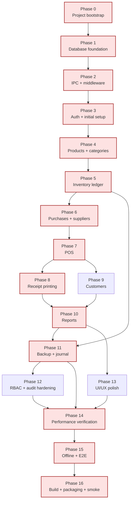

# Implementation Plan: Core Retail ERP V1

## Overview

This plan converts the requirements and design into a sequenced, phase-by-phase build for a single-tenant Electron + React + TypeScript + SQLite + Prisma desktop ERP. The build follows the design's architectural decisions: single-writer main process, one Prisma `$transaction` per business operation, ledger-of-record inventory, and append-only journals.

The plan is organized as 17 phases (0–16). Each phase ends with a checkpoint. Tasks are flat-numbered inside each phase (e.g., `1.1`, `1.2`, `7.1`). Test sub-tasks are marked with `*` and may be skipped for an MVP, except where the design's correctness properties or the requirements' performance/atomicity guarantees can only be validated by tests — those are still flagged but are the main verification surface for the property suite.

Critical path: Phase 0 → 1 → 2 → 3 → 4 → 5 → 6 → 7 → 8 → 10 → 11 → 14 → 15 → 16. Phases 9, 12, and 13 can run in parallel with the late part of the critical path.

Stack:

- Runtime: Electron (main + preload + renderer)
- UI: React 18 + TypeScript, Vite
- DB: SQLite via Prisma (`better-sqlite3` driver path), WAL mode
- Tests: Vitest + fast-check (unit, integration, property), Playwright (E2E)
- Printing: `node-thermal-printer` (ESC/POS) → Electron `webContents.print()` HTML → PDF fallback (`pdfkit`)
- Exports: `papaparse` (CSV) + `pdfkit` (PDF)
- Auth: `bcrypt` (cost 12)
- Packaging: `electron-builder` (Windows installer is the primary V1 target)

## Tasks

### Phase 0 — Project bootstrap

- [x] 0.1 Initialize repository and package metadata
  - Create `package.json` with name `core-retail-erp`, `private: true`, scripts (`dev`, `build`, `test`, `test:unit`, `test:integration`, `test:property`, `test:e2e`, `lint`, `format`, `prisma`, `dist`)
  - Add `.gitignore` for `node_modules`, `dist`, `out`, `*.db`, `backups/`, `receipts/`, `.env`, Playwright artifacts
  - Add `.editorconfig` and `.nvmrc` (Node 20 LTS)
  - _Requirements: 14.1_

- [x] 0.2 TypeScript configuration
  - Root `tsconfig.json` with `strict: true`, `noUncheckedIndexedAccess`, `exactOptionalPropertyTypes`
  - `tsconfig.main.json`, `tsconfig.preload.json`, `tsconfig.renderer.json` extending root, with project-appropriate `lib` and `module` settings
  - Path aliases `@main/*`, `@renderer/*`, `@shared/*`, `@preload/*`
  - _Requirements: 14.1, 15.1_

- [x] 0.3 Vite + Electron build pipeline
  - Install `electron`, `electron-vite` (or equivalent dual-config setup), `vite`, `@vitejs/plugin-react`
  - Configure `electron.vite.config.ts` with three entries: main (Node target), preload (sandbox-safe), renderer (browser target)
  - Wire `npm run dev` to start renderer dev server and Electron with hot reload of main/preload
  - Wire `npm run build` to produce `dist/main`, `dist/preload`, `dist/renderer`
  - _Requirements: 14.1_

- [x] 0.4 Linting and formatting
  - ESLint flat config with `@typescript-eslint`, `eslint-plugin-react`, `eslint-plugin-react-hooks`, import-order rules
  - Prettier config (`.prettierrc`) and `prettier-plugin-organize-imports`
  - `npm run lint` and `npm run format` scripts
  - _Requirements: 14.1_

- [x] 0.5 Test runner installation and base config
  - Install `vitest`, `fast-check`, `@playwright/test`
  - `vitest.config.ts` with three projects: `unit` (`tests/unit`), `integration` (`tests/integration`), `property` (`tests/property`); separate setup files
  - `playwright.config.ts` targeting the packaged Electron app under `tests/e2e`
  - Add a smoke "hello world" test for each tier and confirm all four runners execute green
  - _Requirements: 14.1_

- [x] 0.6 Project folder skeleton
  - Create directory tree exactly matching design's "Project Structure" section: `prisma/`, `src/main/{ipc,services,printing,permission,db}`, `src/preload/`, `src/renderer/{features,components,lib}`, `src/shared/{dto}`, `tests/{unit,integration,property,e2e}`
  - Add a placeholder `index.ts` in each directory so import paths resolve before content is filled in
  - _Requirements: 14.1, 15.1_

- [x] 0.7 Checkpoint — bootstrap green
  - `npm run lint`, `npm run build`, and all four test tiers run green on an empty project
  - Ensure all tests pass, ask the user if questions arise.

### Phase 1 — Database foundation

- [x] 1.1 Prisma schema with all 16 models
  - Author `prisma/schema.prisma` matching design exactly: `Role`, `User`, `Category`, `Product`, `Inventory`, `InventoryMovement`, `Customer`, `Supplier`, `Purchase`, `PurchaseItem`, `Sale`, `SaleItem`, `Payment`, `Setting`, `AuditLog`, `JournalEntry`
  - Include all `@unique`, `@@index`, and `@relation` declarations from design
  - Add the composite cursor indexes that back paginated list channels (Req 15.4, 16.4):
    - `Sale @@index([createdAt(sort: Desc), id])`
    - `InventoryMovement @@index([timestamp(sort: Desc), id])`
    - `AuditLog @@index([timestamp(sort: Desc), id])`
    - `JournalEntry @@index([timestamp(sort: Desc), id])`
  - Use `provider = "sqlite"` and `DATABASE_URL` env
  - _Requirements: 15.1, 15.2, 15.3, 15.4, 2.1, 2.2, 2.3, 4.3, 16.4_

- [x] 1.2 Initial migration
  - Run `prisma migrate dev --name init` to generate the baseline migration
  - Commit migration files under `prisma/migrations/`
  - _Requirements: 15.1_

- [x] 1.3 PRAGMA configuration and Prisma client wrapper
  - Implement `src/main/db/prisma.ts` exporting a singleton `PrismaClient`
  - Apply on every connection: `PRAGMA journal_mode=WAL`, `PRAGMA synchronous=NORMAL`, `PRAGMA foreign_keys=ON`, `PRAGMA busy_timeout=5000`, `PRAGMA wal_autocheckpoint=1000` (Req 16.11)
  - Reserve a placeholder for the weekly `VACUUM`/`ANALYZE` maintenance hook (actual scheduling lives in Phase 11, task 11.2) so the maintenance entry point is wired and unit-testable here
  - Provide `disconnect()` helper for shutdown and tests
  - _Requirements: 11.1, 11.2, 11.3, 15.2, 16.10, 16.11_

- [x] 1.4 Seed script
  - Implement `prisma/seed.ts` to upsert roles `Admin` and `Cashier`, and `Setting` rows: `sale.serialCounter=0`, `backup.retentionDays=14`, `printer.escpos={"kind":"usb","target":""}`, `backup.lastSnapshot=""`
  - Wire `prisma db seed` script in `package.json`
  - _Requirements: 1.6, 8.1, 10.3_

- [x] 1.5 Bundled `shop.db` template build step
  - Add a build step that runs migrations + seed against an empty file then copies `shop.db` to `resources/shop.db.template`
  - First-run logic (filled in Phase 16) will copy this template to `<userData>/shop.db`
  - _Requirements: 14.1, 14.2_

- [x] 1.6\* Integration test — schema and PRAGMAs apply correctly
  - Open a fresh DB through `prisma.ts`, assert `journal_mode=wal`, `foreign_keys=1`
  - Insert and read one row of each model to confirm the schema accepts the design's shapes
  - _Requirements: 11.1, 15.1_

- [x] 1.7 Checkpoint — DB foundation green
  - Migration applies cleanly, seed produces expected rows, PRAGMAs verified
  - Ensure all tests pass, ask the user if questions arise.

### Phase 2 — IPC + middleware foundation

- [x] 2.1 Shared `Result<T, E>` and `ErrorEnvelope`
  - Implement `src/shared/result.ts` with `Result<T,E>`, `Ok()`, `Err()`, and the full `ErrorEnvelope` union from design
  - Add helper `isOk`, `isErr`, `unwrap`, `match`
  - _Requirements: 15.1_ (cross-cutting; underpins Req 1.2, 3.7, 4.8, 4.9, 5.5, 8.4)

- [x] 2.2 Shared IPC contract type
  - Implement `src/shared/ipc-contract.ts` exporting `IpcContract` mapping every channel from design
  - Define the generic paginated envelope used by every list channel:
    ```ts
    export type ListRequest<F, S extends string> = {
      filter?: F;
      search?: string;
      sort?: { key: S; dir: 'asc' | 'desc' };
      cursor?: string; // base64 JSON ({ ts, id }); omitted on first page
      pageSize?: number; // default 50, hard max 200 (clamped server-side)
      withCount?: boolean; // opt-in; otherwise totalCount is omitted
    };
    export type ListResponse<T> = {
      rows: T[];
      nextCursor: string | null;
      totalCount?: number;
    };
    ```
  - Declare every paginated list channel on this envelope: `products:list`, `customers:list`, `suppliers:list`, `sales:list`, `purchases:list`, `inventory_movements:list`, `audit:list`, `journal_entries:list` (Admin-only debug)
  - Declare the companion count channels for views that need a totals strip: `products:count`, `customers:count`, `suppliers:count`, `sales:count`, `purchases:count`, `inventory_movements:count`, `audit:count`, `journal_entries:count`
  - Declare the rest of the channels from design: `auth:login`, `auth:logout`, `products:upsert`, `pos:scan`, `pos:finalize`, `purchase:create`, `inventory:adjust`, `inventory:lowStockCount`, `reports:dailySales`, `reports:monthlySales`, `reports:lowStock`, `reports:topSelling`, `reports:export`, `backup:now`, `backup:restore`, `customers:upsert`, `customers:detail`, `suppliers:upsert`, `suppliers:detail`, `users:list`, `users:upsert`, `users:assignRole`, `settings:get`, `settings:set`, `setup:createInitialAdmin`
  - Each channel declares `req` and `res` shapes; add DTOs under `src/shared/dto/` (`ProductDTO`, `SaleDTO`, `SaleSummaryDTO`, `PurchaseSummaryDTO`, `CustomerDTO`, `SupplierDTO`, `InventoryMovementDTO`, `AuditLogDTO`, `JournalEntryDTO`, `ReceiptDTO`)
  - _Requirements: 1.1, 1.5, 2.1, 4, 5, 6, 7, 8, 9, 10, 13, 15.1, 16.1, 16.2, 16.3_

- [x] 2.10 Shared cursor encoder/decoder utility
  - Implement `src/shared/cursor.ts` with `encodeCursor({ ts: Date|string, id: string }): string` returning `base64(JSON.stringify({ ts: ISOString, id }))`
  - Implement `decodeCursor(token: string): { ts: Date; id: string }` validating that `ts` parses as ISO and `id` is a non-empty string; on any malformed input throw a tagged error that the IPC router maps to `Err('VALIDATION', { field: 'cursor' })`
  - Implement `clampPageSize(input: number | undefined, def = 50, max = 200): number` returning `min(max(input ?? def, 1), max)` so renderer and main share one clamp definition; `paginateCursor` (task 2.5.1) re-uses this helper rather than duplicating the bound
  - Pure module; no Node-only imports so renderer tests can import it for round-trip checks
  - _Requirements: 16.1, 16.2, 16.3_

- [x] 2.11\* Unit tests for cursor utility
  - Round-trip: `decodeCursor(encodeCursor(x)) deep-equals x` for a fast-check generator over `{ ts: Date, id: string }`
  - Tampering: random non-base64, non-JSON, missing-field, wrong-type strings all surface a `VALIDATION` error
  - _Requirements: 16.1, 16.3_

- [x] 2.3 RBAC matrix
  - Implement `src/main/permission/matrix.ts` with `RBAC: Record<keyof IpcContract, Role[]>` covering every channel
  - Export `Permission.allows(role, channel)` and `Permission.channels()` (used by tests)
  - _Requirements: 1.5, 8.1, 8.2, 8.3, 8.4_

- [x] 2.4 IPC router with auth + RBAC + audit middleware
  - Implement `src/main/ipc/router.ts`: a `registerHandler(channel, opts, handler)` API that runs auth check, RBAC check, optional audit decorator, then handler
  - Auth middleware looks up the session in `sessionStore` keyed by `event.sender.id`
  - RBAC middleware consults the matrix; on denial returns `Err('FORBIDDEN')` AND writes an `audit_logs` row of type `rbac.deny`
  - Audit middleware accepts a per-handler descriptor specifying `actionType`, `entityType`, and `previous/next` extractors
  - All handlers return `Result<T, ErrorEnvelope>`
  - _Requirements: 1.5, 8.4, 13.4_

- [x] 2.5 Session store
  - Implement `src/main/auth/session-store.ts` exporting an in-memory `Map<senderId, Session>`; sessions carry `{ userId, role, sessionId, createdAt }`
  - Provide `bind(senderId, session)`, `get(senderId)`, `clear(senderId)`, `clearAll()`
  - _Requirements: 1.4, 1.5_

- [x] 2.6 Preload script
  - Implement `src/preload/index.ts` using `contextBridge.exposeInMainWorld('api', ...)` with one method per IPC channel that delegates to `ipcRenderer.invoke`
  - Generate the method list from `IpcContract` keys (typed)
  - Disable Node integration in renderer; preload runs with `contextIsolation: true`
  - _Requirements: 1.5_

- [x] 2.7 Renderer typed API wrapper
  - Implement `src/renderer/lib/api.ts` exposing `api.<channel>(req): Promise<Result<TRes>>` for every IPC channel, typed against `IpcContract`
  - Add a `useApi()` hook layer that suspends on error envelopes and surfaces toasts for `INTERNAL`/`UNAUTHENTICATED`
  - _Requirements: 1.5_

- [x] 2.8\* Property test — RBAC matrix exhaustiveness (Property 9 placeholder)
  - **Property 9 placeholder:** Static test that every key of `IpcContract` is present in `RBAC` and every role appearing is one of `Admin`/`Cashier`
  - Full Property 9 runtime enforcement test lives in Phase 12
  - _Requirements: 8.1, 8.2, 8.3_

- [x] 2.9 Checkpoint — IPC plumbing green
  - A trivial echo channel routes through middleware, returns `Result`, and a renderer dummy page can call it
  - Ensure all tests pass, ask the user if questions arise.

### Phase 2.5 — List pagination helper

- [x] 2.5.1 `paginateCursor` helper in main process
  - Implement `src/main/db/paginate.ts` exposing `paginateCursor(model, { filter, search, sort, cursor, pageSize, withCount })` that emits the cursor SQL shape from design:
    `WHERE <filter> AND (sort_col, id) < (?, ?) ORDER BY sort_col DESC, id DESC LIMIT pageSize`
  - Clamp `pageSize` to `min(max(input ?? 50, 1), 200)` server-side regardless of renderer input
  - Decode `cursor` via `src/shared/cursor.ts` (Phase 2 task 2.10); reject malformed tokens with `Err('VALIDATION', { field: 'cursor' })`
  - Compute `nextCursor` from the last returned row using `encodeCursor`; return `nextCursor: null` when fewer than `pageSize` rows are returned
  - When `withCount: true`, run a single companion `COUNT(*)` against the filtered set; otherwise omit `totalCount`
  - Support both descending (default, list view) and ascending (replay) directions via a `direction: 'desc' | 'asc'` option used internally by `replayJournal`
  - Every list service in `src/main/services/` MUST call this helper rather than rolling its own cursor SQL
  - _Requirements: 15.4, 16.1, 16.2, 16.3, 16.4, 16.9_

- [x] 2.5.2\* Unit tests for `paginateCursor`
  - Cursor encode/decode round-trip across a synthetic 5,000-row in-memory dataset
  - `pageSize` clamping: input `0`, `-1`, `201`, and `1_000_000` all clamped to `[1, 200]`
  - `withCount` opt-in: response includes `totalCount` iff requested
  - Ascending replay direction returns the same row set as descending in reverse order
  - Walking pages from first to `nextCursor === null` yields exactly the reference query's rows in the same order (Property 16 unit-level scaffold)
  - _Requirements: 16.1, 16.2, 16.3_

- [x] 2.5.3 Checkpoint — pagination helper green
  - Helper passes its unit tests; one trivial list channel (e.g. `products:list`) is wired through it end-to-end
  - Ensure all tests pass, ask the user if questions arise.

### Phase 3 — Auth and initial setup

- [x] 3.1 AuthService
  - Implement `src/main/services/auth.service.ts` with `login(username, password)`, `logout(sessionId)`, `createInitialAdmin(username, password)`, `hasAnyAdmin()`
  - Use `bcrypt` with cost factor 12 for both hashing on creation and `compare` on login
  - On successful login, allocate a session and bind it to the renderer's sender id via `session-store`
  - _Requirements: 1.1, 1.2, 1.3, 1.4, 1.6_

- [x] 3.2 Auth IPC handlers
  - Wire `auth:login`, `auth:logout`, `setup:createInitialAdmin` through the router
  - `auth:login` and `auth:logout` are public (no session required); `setup:createInitialAdmin` is allowed only when `hasAnyAdmin()` is false
  - _Requirements: 1.1, 1.2, 1.4, 1.6_

- [x] 3.3 Login screen
  - Implement `src/renderer/features/login/LoginPage.tsx` with username, password, submit, error display
  - On success, store role + sessionId in renderer auth context and navigate to role home
  - _Requirements: 1.1, 1.2, 1.5_

- [x] 3.4 Initial Admin Setup screen (first-run gate)
  - Implement `src/renderer/features/setup/SetupPage.tsx`
  - On app start, renderer calls a `setup:isRequired` check; if true, route is forced to setup before login
  - Setup form requires username + password + confirm; submits via `setup:createInitialAdmin`
  - _Requirements: 1.6, 14.2_

- [x] 3.5 Session lifecycle wiring
  - On `app.before-quit` and `BrowserWindow.closed`, clear all sessions
  - On renderer reload, force re-login (sessions are bound to sender id)
  - _Requirements: 1.4, 1.5_

- [x] 3.6\* Integration tests — auth happy path and rejections
  - Login with valid creds returns a session and role
  - Wrong password returns `Err('VALIDATION')` (or `UNAUTHENTICATED` per envelope) and increments no audit row
  - `setup:createInitialAdmin` is rejected once an Admin already exists
  - `passwordHash` is never present in any IPC response
  - _Requirements: 1.1, 1.2, 1.3, 1.6_

- [x] 3.7 Checkpoint — auth green
  - Fresh install routes to setup, after admin creation the login screen accepts the new admin, and protected channels reject calls without a session
  - Ensure all tests pass, ask the user if questions arise.

### Phase 4 — Product and category management

- [x] 4.1 CategoryService and IPC
  - Implement `category.service.ts` (kept inside `product.service.ts` per design) with `list()`, `upsert(input)`, `delete(id)` (delete only if no products reference)
  - Wire `categories:list`, `categories:upsert`, `categories:delete`
  - _Requirements: 2.5_

- [x] 4.2 ProductService — list, get, upsert
  - Implement `product.service.ts` with `list({search})`, `getById`, `getByBarcode`, `upsert(input)`
  - Enforce unique `sku` and unique `barcode` (when present) via Prisma constraints; map unique violations to `Err('UNIQUE_VIOLATION')` with field details
  - On creation, also create the `Inventory` row with `onHand = 0`
  - _Requirements: 2.1, 2.2, 2.3, 2.5, 7 (read-only access)_

- [x] 4.3 ProductService — audit price changes
  - When `buyPrice` or `sellPrice` change on update, write an `audit_logs` row of type `price.change` inside the same `$transaction` as the product update, capturing previous and new values
  - _Requirements: 2.4, 13.1_

- [x] 4.4 Product list, create, edit pages
  - `src/renderer/features/products/`: `ProductsListPage.tsx` (search + table), `ProductFormPage.tsx` (create + edit)
  - List page uses cursor pagination via `products:list` (default `pageSize: 50`, max 200) and renders rows through the shared `<VirtualizedTable>` component (task 4.8) backed by `react-window`
  - Search input is debounced 250 ms before issuing the next `products:list` request; filter changes reset the cursor
  - Form validates required fields client-side; all uniqueness errors come from server envelope
  - Cashier role gets read-only list; create/edit hidden
  - _Requirements: 2.1, 2.2, 2.3, 2.5, 8.3, 16.1, 16.3, 16.5_

- [x] 4.8 Shared `<VirtualizedTable>` component
  - Implement `src/renderer/components/VirtualizedTable.tsx` wrapping `react-window`'s `FixedSizeList` (or `VariableSizeList` where row heights differ) and exposing a typed `usePaginatedList(channel, params)` data hook that drives any `*:list` channel under the `ListRequest`/`ListResponse` envelope
  - Hook owns: cursor state, `pageSize` (default 50, capped 200), debounced search forwarding (250 ms), in-flight request cancellation on filter change, append-on-scroll page accumulation, and visible-window slicing for `react-window`
  - Optional `withCount` prop renders a totals strip via the companion `*:count` channel
  - Component is the reuse target for products, customers, suppliers, sales, purchases, inventory_movements, audit, journal, and any reports preview that can exceed 200 rows
  - _Requirements: 16.1, 16.2, 16.3, 16.5_

- [ ]\* 4.9 Unit tests for `<VirtualizedTable>` data hook
  - Mock IPC; assert page accumulation matches concatenated mock pages, debounce window suppresses intermediate requests, and DOM-mounted row count stays bounded for a 10,000-row mock dataset
  - _Requirements: 16.5_

- [x] 4.5\* Property test — Property 7: uniqueness of product identifiers
  - **Property 7: Uniqueness of product identifiers**
  - **Validates: Requirements 2.2, 2.3**
  - fast-check generator yields random product inputs; assert any second insert that reuses a `sku` or `barcode` is rejected and that no two persisted products share `sku` or `barcode`

- [x] 4.6\* Integration test — price-change audit
  - Update `sellPrice`, assert exactly one new `audit_logs` row of type `price.change` with correct previous/next
  - _Requirements: 2.4, 13.1_

- [x] 4.7 Checkpoint — products green
  - Admin can create, edit, list products; barcode uniqueness rejected; price change appears in audit log
  - Ensure all tests pass, ask the user if questions arise.

### Phase 5 — Inventory ledger (the heart)

- [x] 5.1 InventoryService — ledger writer
  - Implement `inventory.service.ts` with internal `applyMovement(tx, {productId, delta, type, refType, refId, userId})` helper used by every business tx
  - The helper updates `Inventory.onHand` (decrement or increment) AND inserts exactly one `InventoryMovement` inside the caller's `$transaction`
  - Throw `OutOfStockError(productId)` if `onHand + delta < 0`
  - _Requirements: 3.1, 3.2, 3.7, 11.4_

- [x] 5.2 InventoryService — manual adjustment
  - Public `adjust({productId, delta, reason}, ctx)` opens a `$transaction`, calls `applyMovement`, writes an `audit_logs` row of type `stock.adjust`, and writes a `journal_entries` row of opType `adjustment`
  - Wire `inventory:adjust` (Admin only)
  - _Requirements: 3.5, 13.3_

- [x] 5.3 InventoryService — low-stock query
  - Implement `lowStockCount()` and `lowStockList()` using `Inventory.onHand <= Product.reorderLevel`
  - Wire `inventory:lowStockCount`, `inventory:lowStock`
  - _Requirements: 3.6_

- [x] 5.5.1 InventoryMovement paginated list service and IPC channel
  - Implement `inventory.service.ts#listMovements(req)` calling `paginateCursor` on `InventoryMovement` ordered by `(timestamp DESC, id)`; supports filters `productId`, `movementType`, `dateFrom`, `dateTo`
  - Wire `inventory_movements:list` and the companion `inventory_movements:count` (Admin only) through the router
  - _Requirements: 3.1, 16.1, 16.2, 16.3, 16.4_

- [x] 5.5.2 Inventory movements browser page (Admin)
  - `src/renderer/features/inventory/MovementsBrowserPage.tsx`: virtualized table via `<VirtualizedTable>`, filters for product (typeahead), movement type (`sale` | `purchase` | `adjustment` | `return`), and date range; row click navigates to the originating sale/purchase/adjustment
  - Uses `inventory_movements:list` with cursor pagination
  - _Requirements: 3.1, 8.2, 16.1, 16.5_

- [x] 5.4 Manual stock adjustment UI
  - `src/renderer/features/inventory/AdjustPage.tsx`: pick product, enter delta, reason; Admin only
  - On success, toast and refresh
  - _Requirements: 3.5, 8.2_

- [x] 5.5\* Property test — Property 1: inventory ledger identity
  - **Property 1: Inventory ledger identity**
  - **Validates: Requirements 3.1, 3.2, 11.4**
  - fast-check generates random sequences of purchases, sales, and adjustments; after each commit, assert `Inventory.onHand == sum(InventoryMovement.quantityDelta)` for every touched product

- [x] 5.6\* Property test — Property 3: non-negative on-hand
  - **Property 3: Non-negative on-hand**
  - **Validates: Requirement 3.7**
  - Generate sequences that include over-stock sale attempts; assert every commit leaves `onHand >= 0` and that out-of-stock attempts produce `Err('OUT_OF_STOCK')` and no movement rows

- [x] 5.7 Checkpoint — inventory ledger green
  - Manual adjustment works, ledger identity holds under property tests, low-stock query is correct
  - Ensure all tests pass, ask the user if questions arise.

### Phase 6 — Purchase system

- [x] 6.1 SupplierService and pages
  - Implement `supplier.service.ts` with `list(req)` calling `paginateCursor` on `Supplier` ordered by `(name ASC, id ASC)`, `upsert`, `detail(id)` returning paginated purchase history (cursor on `(createdAt DESC, id)`)
  - Wire `suppliers:list`, `suppliers:upsert`, `suppliers:detail` (Admin only for write; read allowed for Admin)
  - Pages: `SuppliersListPage` (virtualized via `<VirtualizedTable>` with cursor pagination), `SupplierFormPage`, `SupplierDetailPage`
  - _Requirements: 6.1, 6.2, 6.3, 16.1, 16.3, 16.5_

- [x] 6.2 PurchaseService — atomic create
  - Implement `purchase.service.ts` `create(input, ctx)` that opens one `$transaction`:
    1. Insert `Purchase` header
    2. Insert `PurchaseItem` rows with `lineTotal = quantity * unitBuyPrice`
    3. For each line, call `inventory.applyMovement` (positive delta, type `purchase`)
    4. Insert one `journal_entries` row of opType `purchase`
  - Map FK violations to `Err('FK_VIOLATION')`
  - _Requirements: 5.1, 5.2, 5.3, 5.4, 5.5, 11.2_

- [x] 6.3 Purchase create page
  - `src/renderer/features/purchases/PurchaseCreatePage.tsx`: pick supplier, add product lines, enter quantity + unit buy price, submit
  - Read-only purchase list page showing recent purchases
  - _Requirements: 5.1, 5.2, 5.3_

- [x] 6.4\* Integration test — purchase atomicity
  - Submit a valid purchase; assert header + items + movements + journal exist together
  - Inject a failure mid-tx (e.g., bad productId on second line); assert nothing is persisted (Property 6 partial coverage)
  - _Requirements: 5.1, 5.5, 11.2_

- [x] 6.5 Checkpoint — purchases green
  - Admin can record a purchase, inventory increments, supplier purchase history reflects it
  - Ensure all tests pass, ask the user if questions arise.

### Phase 7 — POS system (single-screen)

- [x] 7.1 Totals math module (pure)
  - Implement `src/main/services/pos/totals.ts` and a renderer-side mirror in `src/renderer/features/pos/totals.ts` (or a shared helper in `src/shared/`)
  - Functions: `computeSubtotal(items)`, `applyDiscount(subtotal, discount)`, `computeTaxTotal(items, discountRatio)`, `computeGrandTotal(...)`, `validateTotalsIdentity(input)`
  - Handles fixed-amount and percentage discount; tax computed on post-discount subtotal with proportional per-line allocation per design
  - _Requirements: 4.4, 4.5, 4.6, 2.6_

- [x] 7.2 POSService — `scan(barcode)`
  - Implement in `pos.service.ts`: `findUnique` on `Product.barcode`; return `ProductDTO | null` (no DB writes)
  - Wire `pos:scan` (Admin + Cashier)
  - _Requirements: 4.1, 12.1_

- [x] 7.3 POSService — serial number allocator
  - Implement `nextSerial(tx)` that reads `Setting 'sale.serialCounter'`, increments, writes back inside the same tx, and formats `INV-XXXXXX`
  - _Requirements: 4.3_

- [x] 7.4 POSService — `finalizeSale(input, ctx)`
  - One `$transaction`:
    1. `validateTotalsIdentity(input)` (`Err('VALIDATION')` on mismatch, including payments sum vs grand total)
    2. For each line, read `Inventory.onHand`; throw `OutOfStockError` if any line would underflow
    3. Allocate serial via `nextSerial(tx)`
    4. Insert `Sale` + `SaleItem[]` + `Payment[]`
    5. For each line, call `inventory.applyMovement` (negative delta, type `sale`)
    6. Insert one `journal_entries` row of opType `sale`
  - After commit (outside tx), trigger printer chain (Phase 8)
  - Map errors to envelope codes (`OUT_OF_STOCK`, `VALIDATION`, `FK_VIOLATION`, `INTERNAL`)
  - Wire `pos:finalize` (Admin + Cashier)
  - _Requirements: 4.2, 4.3, 4.4, 4.5, 4.6, 4.9, 11.1, 12.2_

- [ ] 7.5 POS UI — single-screen layout
  - `src/renderer/features/pos/POSPage.tsx`: scanner-focused input top, cart middle, totals + discount + customer attach right, payment panel bottom; reachable in one click from home
  - Scanner input keeps focus by default and re-focuses after every action
  - Cart row height ≥ 56px; payment buttons ≥ 80px
  - _Requirements: 4.1, 4.4, 4.5, 4.6, 14.3_

- [ ] 7.6 POS UI — cart, discount, payment, customer attach, finalize
  - Cart add/remove/quantity edit, fixed-amount or percentage discount input, cash/card/mobile split payments with running balance, optional customer attach (deferred wiring to Phase 9)
  - Out-of-stock errors render inline on offending cart line and disable finalize
  - _Requirements: 4.1, 4.4, 4.5, 4.6, 7.4_

- [x] 7.7\* Property test — Property 2: sale totals identity
  - **Property 2: Sale totals identity**
  - **Validates: Requirements 4.4, 4.5, 4.6**
  - Generate random carts (line counts, prices, tax rates, fixed/percent discounts, split payments); finalize and assert `subtotal − discount + taxTotal == grandTotal == sum(payments.amount)` on the persisted sale

- [x] 7.8\* Property test — Property 4: monotonic, unique sale serials
  - **Property 4: Strictly monotonic, unique sale serials**
  - **Validates: Requirement 4.3**
  - Run sequential and concurrent finalize batches; assert serials are pairwise unique and form a strictly increasing integer sequence when sorted by `createdAt`

- [x] 7.9\* Property test — Property 8: tax on post-discount subtotal
  - **Property 8: Tax line uses post-discount subtotal**
  - **Validates: Requirements 2.6, 4.5**
  - For random carts and discounts, assert `taxTotal == sum( line.qty * line.unitPrice * (1 − discount/subtotal) * line.taxRate )` on the persisted sale within rounding tolerance

- [x] 7.10 Checkpoint — POS green (no printer yet)
  - End-to-end finalize works in dev; serials are unique; totals identity holds; out-of-stock blocks finalize
  - Ensure all tests pass, ask the user if questions arise.

### Phase 8 — Receipt printing

- [ ] 8.1 Receipt DTO and renderer
  - Implement `src/shared/dto/receipt.ts` `ReceiptDTO` with shop info, sale serial, lines, totals, payments, timestamp
  - Implement `src/main/printing/receipt.render.ts` building the DTO from a committed sale
  - _Requirements: 4.7, 4.8_

- [ ] 8.2 ESC/POS adapter
  - Implement `src/main/printing/escpos.adapter.ts` using `node-thermal-printer`
  - Reads `Setting 'printer.escpos'` for `{kind, target}`; supports `usb`, `serial`, `network`
  - `print(receipt)` throws on hardware/timeout failure
  - _Requirements: 4.7_

- [ ] 8.3 HTML adapter
  - Implement `src/main/printing/html.adapter.ts` rendering an HTML receipt template and triggering Electron `webContents.print({silent: true, deviceName})`
  - _Requirements: 4.8_

- [ ] 8.4 PDF adapter (last-resort)
  - Implement `src/main/printing/pdf.adapter.ts` using `pdfkit` writing to `<userData>/receipts/INV-XXXXXX.pdf`
  - _Requirements: 4.8_

- [ ] 8.5 ChainAdapter and `selectPrinter()`
  - Implement `src/main/printing/printer.ts` with `ChainAdapter` trying ESC/POS → HTML → PDF; first success wins
  - Wire from POSService after `finalizeSale` commit; printer failures never roll back the sale
  - _Requirements: 4.7, 4.8, 4.9_

- [ ] 8.6 Settings UI for printer configuration
  - `src/renderer/features/settings/PrinterSettingsPage.tsx`: pick `kind`, enter `target`, test print button (Admin only)
  - Persists via `settings:set` to `printer.escpos`
  - _Requirements: 4.7, 8.2_

- [ ] 8.7\* Integration test — printer chain fallback
  - Mock ESC/POS adapter to throw; assert HTML adapter is invoked and the chain resolves successfully
  - Mock both ESC/POS and HTML to throw; assert PDF file is written under `receipts/`
  - _Requirements: 4.7, 4.8_

- [ ] 8.8 Checkpoint — printing green
  - Receipts print via thermal in dev (or fallback to HTML/PDF); failure does not roll back sale
  - Ensure all tests pass, ask the user if questions arise.

### Phase 9 — Customer management

- [ ] 9.1 CustomerService
  - Implement `customer.service.ts` with `list(req)` calling `paginateCursor` on `Customer` (sort `name ASC, id ASC`; filter `phonePrefix`), `upsert`, `detail(id)` returning paginated sale history (cursor on `(createdAt DESC, id)`)
  - Wire `customers:list`, `customers:upsert`, `customers:detail`
  - _Requirements: 7.1, 7.3, 16.1, 16.3, 16.4_

- [ ] 9.2 Customer pages
  - `CustomersListPage` (virtualized via `<VirtualizedTable>` with cursor pagination on `customers:list`, debounced phone-prefix search), `CustomerFormPage`, `CustomerDetailPage` (paginated sale history)
  - Read access for Admin and Cashier; write access for Admin only
  - _Requirements: 7.1, 7.3, 8.3, 16.1, 16.3, 16.5_

- [ ] 9.3 Attach customer to sale flow
  - Add the customer-attach control to POS (already stubbed in 7.6); on finalize, `customerId` is sent and persisted on the `Sale` row; walk-in sales send `null`
  - _Requirements: 7.2, 7.4_

- [ ] 9.4\* Integration test — customer history reflects sales
  - Create customer, finalize two sales attached to that customer; assert `customer:detail` returns both sales ordered by date desc
  - _Requirements: 7.3_

- [ ] 9.5 Checkpoint — customers green
  - Customer create/list/detail works; sales correctly attach (or omit) customer
  - Ensure all tests pass, ask the user if questions arise.

### Phase 10 — Reports

- [ ] 10.1 ReportService — daily sales
  - Implement `report.service.ts` `dailySales({date})`: total sales count, total revenue, total tax, total discounts, per-payment-method breakdown
  - Wire `reports:dailySales` (Admin only)
  - _Requirements: 9.1_

- [ ] 10.2 ReportService — monthly sales
  - `monthlySales({year, month})`: total sales count, total revenue, total tax, total discounts
  - Wire `reports:monthlySales`
  - _Requirements: 9.2_

- [ ] 10.3 ReportService — low-stock summary
  - `lowStockSummary()`: `sku`, `name`, `onHand`, `reorderLevel` for every product where `onHand <= reorderLevel`
  - Wire `reports:lowStock`
  - _Requirements: 9.3, 3.6_

- [ ] 10.4 ReportService — top-selling
  - `topSelling({from, to})`: products ordered by total units sold desc within range
  - Wire `reports:topSelling`
  - _Requirements: 9.4_

- [ ] 10.5 Streaming CSV export (`papaparse`)
  - Implement `src/main/services/report/csv-export.ts` writing to a Node `WriteStream` opened from a user-chosen path via `dialog.showSaveDialog`
  - Drives the underlying SELECT via `paginateCursor` internally (same `(sort DESC, id)` cursor used by list channels) so at most `pageSize` rows are resident at any one time
  - Calls `papaparse.unparse(batch, { header: i === 0 })` per batch and writes the line block directly to the stream; emits the header on the first batch only
  - Resolves only after the stream's `finish` event; never buffers the full result set
  - _Requirements: 9.5, 16.3, 16.6_

- [ ] 10.6 Streaming PDF export (`pdfkit`)
  - Implement `src/main/services/report/pdf-export.ts` using `pdfkit` in streaming mode: `doc.pipe(fs.createWriteStream(path))`
  - Pages flushed by the library as `addPage()` is called; the row pump uses the same cursor pagination as 10.5 so memory does not grow with row count
  - Header, summary table, and per-batch line items rendered incrementally; resolves only after the writable stream's `finish` event
  - _Requirements: 9.5, 16.3, 16.6_

- [ ] 10.7 Combined export handler
  - Wire `reports:export` to produce both CSV and PDF for a given report id and return both paths
  - Both encoders sit behind a single shared cursor-paginated SELECT so doubling the output formats does not double the memory footprint — the row buffer is shared and disposed per batch
  - Returns `{ path, rowCount }` (or `{ csvPath, pdfPath, rowCount }` when both formats are requested) only after both encoder `finish` events
  - _Requirements: 9.5, 16.6_

- [ ] 10.8 Reports pages
  - `src/renderer/features/reports/`: pages for daily, monthly, low-stock, top-selling; date pickers; export button
  - Any preview table that can exceed 200 rows (top-selling for wide ranges, low-stock at large catalogs) renders through `<VirtualizedTable>` driven by cursor pagination on the relevant `*:list` channel
  - _Requirements: 9.1, 9.2, 9.3, 9.4, 9.5, 16.5_

- [ ] 10.9 Low-stock banner component
  - `src/renderer/components/LowStockBanner.tsx`: subscribes to `inventory:lowStockCount`, visible on every screen when count > 0; click navigates to low-stock report
  - _Requirements: 3.6, 9.3_

- [ ] 10.10\* Property test — Property 10: report aggregates equal SQL aggregates
  - **Property 10: Report aggregates equal SQL aggregates**
  - **Validates: Requirements 6.2, 6.3, 7.3, 9.1, 9.2, 9.3, 9.4**
  - Seed random sales/purchases/customers/suppliers; assert each report's values equal independently computed SQL aggregates over the same data set

- [ ] 10.11\* Property test — Property 11: report export round-trip
  - **Property 11: Report export round-trip**
  - **Validates: Requirement 9.5**
  - For random row sets, assert CSV parses back to an equal row set; assert PDF contains every value from key columns as extractable text

- [ ] 10.12 Checkpoint — reports green
  - All four reports produce expected numbers; CSV+PDF export works
  - Ensure all tests pass, ask the user if questions arise.

### Phase 11 — Backup and journal

- [ ] 11.1 BackupService — VACUUM INTO snapshots
  - Implement `backup.service.ts` `takeSnapshot()` that runs `VACUUM INTO '<userData>/backups/shop-YYYY-MM-DD.db'` against the live DB
  - Updates `Setting 'backup.lastSnapshot'` with ISO timestamp
  - _Requirements: 10.1, 10.2_

- [ ] 11.2 Scheduler (on-launch + 30-min interval) and manual trigger
  - On app start, if today has no snapshot, take one
  - `setInterval(30 minutes)` re-checks the daily-snapshot condition
  - Wire `backup:now` (Admin only)
  - Add a weekly `VACUUM` + `ANALYZE` cron via `node-cron` driven by the `Setting` key `maintenance.cron` (default `0 3 * * 0` — Sunday 03:00); on each tick, run `VACUUM` then `ANALYZE` against the live DB and log duration to the journal as a maintenance event
  - Document the maintenance window UI surface in settings (a read-only display of the active cron, last run, and next scheduled run; full edit moves to a future revision)
  - _Requirements: 10.1, 10.2, 16.10_

- [ ] 11.2.1 WAL checkpoint fallback timer
  - In addition to `wal_autocheckpoint=1000` set in task 1.3, register a `setInterval(60 minutes)` in the main process that runs `PRAGMA wal_checkpoint(PASSIVE)` so the WAL file is checkpointed at least once per hour even under low write volume
  - Cleared on app quit; no-op if the DB connection is closed
  - _Requirements: 16.11_

- [ ] 11.3 Retention enforcement
  - After every snapshot, keep the N most recent files (read N from `Setting 'backup.retentionDays'`, default 14); delete older
  - _Requirements: 10.3_

- [ ] 11.4 Journal entry integration audit
  - Verify (and add where missing) that every business `$transaction` (sale, purchase, adjustment, price.change, role.change) ends with one `journal_entries` insert carrying a JSON payload sufficient to replay the event
  - _Requirements: 10.4, 10.5_

- [ ] 11.5 Append-only static guarantee
  - Add a lint rule (custom ESLint rule or grep-based check in CI) that fails the build on any reference to `prisma.journalEntry.update`, `prisma.journalEntry.delete`, `prisma.auditLog.update`, or `prisma.auditLog.delete` within `src/`
  - _Requirements: 10.5, 13.4_

- [ ] 11.6 Recovery flow — integrity check, restore, replay
  - On startup, run `PRAGMA integrity_check`
  - On non-`ok`, show the recovery prompt (Admin auth required)
  - On accept: copy latest `backups/shop-*.db` over `shop.db`, reopen, then drive a batched journal replay using the cursor walk shape from design — 1000-row batches via `paginateCursor` against `journal_entries` ordered ASC on `(timestamp, id)`, each batch executed in one `$transaction`, with idempotent `upsert` keyed on the deterministic `referenceId` so partial replays are safe to resume
  - On cancel: refuse to start
  - _Requirements: 10.6, 11.3, 16.8_

- [ ] 11.6.1 `replayJournal()` helper
  - Implement `src/main/services/backup/replay.ts` exposing `replayJournal(snapshotTs: Date)` that loops `paginateCursor` (ascending direction) over `journal_entries WHERE timestamp >= snapshotTs`, applying each batch in a single `$transaction` and dispatching to per-opType replay handlers (`sale`, `purchase`, `adjustment`, `price.change`, `role.change`)
  - Each handler uses Prisma `upsert` on the deterministic primary key carried in the journal payload so re-running the same entry is a no-op
  - Crash-safety: killing the process mid-replay leaves at most one in-flight 1000-row batch un-applied; on the next launch the same cursor walk resumes from the last committed batch
  - _Requirements: 10.6, 11.3, 16.8_

- [ ] 11.7 Backup UI panel in settings
  - `src/renderer/features/backup/BackupPage.tsx`: list snapshots with timestamps, "Backup now" button, "Restore" button per snapshot (Admin only, with confirmation)
  - _Requirements: 10.1, 10.2_

- [ ] 11.8\* Property test — Property 5: append-only journals
  - **Property 5: Append-only journals**
  - **Validates: Requirements 10.4, 10.5, 13.1, 13.2, 13.3, 13.4**
  - Static check: assert no source file under `src/` calls `update`/`delete` on `journalEntry` or `auditLog`
  - Runtime: drive every business operation; assert exactly one `journal_entries` row per commit and exactly one `audit_logs` row per sensitive operation, and no row is ever modified

- [ ] 11.9\* Property test — Property 12: recovery equivalence
  - **Property 12: Recovery equivalence**
  - **Validates: Requirements 10.6, 11.3**
  - Generate a random op sequence with a snapshot at random index k; restore + replay; assert the resulting DB state is observationally equivalent to running all ops without snapshot (sales, items, payments, inventory, movements, audit, journal counts and contents match)

- [ ] 11.10\* Property test — Property 6: all-or-nothing business transactions
  - **Property 6: All-or-nothing business transactions** (extended for kill-mid-replay convergence)
  - **Validates: Requirements 3.3, 3.4, 4.9, 5.1, 5.5, 11.1, 11.2, 11.3, 16.8**
  - Inject a thrown error at every transactional step inside `finalizeSale`, `purchase.create`, and `inventory.adjust`; after restart, assert either all expected rows are present or none are; for at least one scenario, simulate a hard kill mid-tx (using a Prisma middleware that calls `process.kill(process.pid, 'SIGKILL')` in a child process) and assert the same outcome on relaunch
  - **Kill-mid-replay convergence leg:** drive a backup → corruption → recovery flow against a random op sequence; partway through the batched journal replay (task 11.6 / 11.6.1), `SIGKILL` the process at a random batch boundary; on next launch, assert the replay resumes from the last committed cursor and the final DB state is observationally equivalent to the same op sequence replayed without interruption (same row counts and contents across `Sale`, `SaleItem`, `Payment`, `Inventory`, `InventoryMovement`, `JournalEntry`, `AuditLog`)

- [ ] 11.11 Checkpoint — backup + journal green
  - Snapshots schedule, retain, and restore correctly; recovery replay reproduces state
  - Ensure all tests pass, ask the user if questions arise.

### Phase 12 — RBAC enforcement and audit hardening

- [ ] 12.1 Audit log viewer page
  - `src/renderer/features/users/AuditLogPage.tsx` (or under settings): list `audit_logs` rows via `audit:list` with cursor pagination through `<VirtualizedTable>`; filters by `actionType`, `userId`, date range; Admin only
  - Wire `audit:list` and `audit:count` (companion total)
  - _Requirements: 13.1, 13.2, 13.3, 13.4, 16.1, 16.5_

- [ ] 12.1.1 RBAC matrix coverage for paginated list channels
  - Update `src/main/permission/matrix.ts` so every paginated list channel and its `*:count` companion is explicitly registered:
    - Admin-only: `sales:list`, `sales:count`, `purchases:list`, `purchases:count`, `inventory_movements:list`, `inventory_movements:count`, `audit:list`, `audit:count`, `journal_entries:list`, `journal_entries:count`, `suppliers:list`, `suppliers:count`
    - Admin + Cashier (read-only catalog and customer browse): `products:list`, `products:count`, `customers:list`, `customers:count`
  - Property 9 (task 12.3) automatically picks these up via the `IpcContract` exhaustiveness check
  - _Requirements: 8.1, 8.2, 8.3, 8.4, 16.1_

- [ ] 12.2 Role assignment auditing
  - Implement `users:assignRole` (Admin only) that updates `User.roleId` and writes an `audit_logs` row of type `role.change` carrying previous role, new role, acting user, target user, timestamp — all inside one `$transaction`
  - _Requirements: 8.5, 13.2_

- [ ] 12.3\* Property test — Property 9: RBAC matrix is enforced on every IPC channel
  - **Property 9: RBAC matrix is enforced on every IPC channel**
  - **Validates: Requirements 1.5, 8.2, 8.3, 8.4**
  - For every channel `c` and role `r`, drive an invocation through the router; assert success iff `RBAC[c].includes(r)`; assert every denial appends an `audit_logs` row of type `rbac.deny`

- [ ] 12.4\* Property test — Property 13: referential integrity
  - **Property 13: Referential integrity**
  - **Validates: Requirement 15.2**
  - For each FK pair from Req 15.2, attempt insert/update with a non-existent foreign id; assert the operation is rejected and no row is persisted

- [ ] 12.5 Checkpoint — RBAC + audit hardened
  - Cashier denied for every Admin-only channel with an audit row; Admins can review the audit log
  - Ensure all tests pass, ask the user if questions arise.

### Phase 13 — UI/UX polish and shell

- [ ] 13.1 Routing and role-aware shell
  - `src/renderer/App.tsx` + `routes.tsx`: route-level guards based on session role; redirect to login if no session; Cashier home navigates straight to POS, Admin home navigates to dashboard
  - _Requirements: 1.5, 8.3, 14.3_

- [ ] 13.2 Admin dashboard home
  - `src/renderer/features/dashboard/DashboardPage.tsx`: today's sales total, today's transaction count, low-stock count, quick links to POS, products, reports, backup
  - _Requirements: 9.1, 3.6_

- [ ] 13.3 Cashier home → POS direct
  - On Cashier login, route directly to POS; provide top-bar logout
  - _Requirements: 14.3_

- [ ] 13.4 Toast and error system
  - `src/renderer/components/ui/Toast.tsx` + provider; central handler that maps `ErrorEnvelope.code` to user-friendly messages; inline form errors via field-level state
  - _Requirements: 1.2, 3.7, 4.8, 4.9, 5.5_ (envelope-driven error surfacing)

- [ ] 13.5 POS keyboard shortcuts F1–F9
  - Bind: `F1` add product manually, `F2` apply discount, `F3` attach customer, `F4` pay cash, `F5` pay card, `F6` pay mobile, `F9` finalize
  - Show shortcut hints on hover
  - _Requirements: 4, 14.3_

- [ ] 13.6 Low-stock banner integration
  - Mount `LowStockBanner` (built in 10.9) in shell layout; visible on every authenticated route
  - _Requirements: 3.6_

- [ ] 13.7 Checkpoint — shell + UX green
  - Shell routes correctly per role; banner renders; toasts surface envelope errors; F-keys drive POS without mouse
  - Ensure all tests pass, ask the user if questions arise.

### Phase 14 — Performance verification

- [ ] 14.1 Performance seed — 10,000-product catalog + 1,000,000-row sales dataset
  - Implement `tests/property/seed-10k.ts` that wipes a test DB and inserts 10,000 products with realistic SKU/barcode distribution and a small movement history per product (drives the existing scan/finalize budget for Property 15)
  - Implement `tests/property/seed-1m.ts` that, on top of the 10k catalog, generates 1,000,000 `Sale` rows with realistic distribution of `SaleItem`, `Payment`, `InventoryMovement`, `JournalEntry`, and `AuditLog` rows: ~3 items per sale on average, mixed `cash`/`card`/`mobile` payments, sales spread across ~3 years of `createdAt`, customers attached on ~40% of sales
  - Inserts performed via `prisma.$transaction` batches of 1,000 with `runInTransaction: true` to keep WAL writes bounded; expected total runtime ~minutes, not hours
  - Add `npm run perf:seed` (10k) and `npm run perf:seed:1m` (full) scripts; CI uses the 1M seed for Properties 16 and 17
  - _Requirements: 12.1, 12.2, 12.4, 16.6, 16.9_

- [ ] 14.2\* Property test — Property 15: scan and finalize performance
  - **Property 15: Scan and finalize performance**
  - **Validates: Requirements 4.1, 4.2, 12.1, 12.2**
  - Against the 10k seed, run 1000 random `pos:scan` calls and assert p95 < 200 ms
  - Run 200 random `pos:finalize` calls (1–5 line carts, mixed payments) and assert p95 of the commit boundary (excluding printer I/O) < 500 ms
  - Run on CI hardware spec recorded in test output for reproducibility

- [ ] 14.4\* Property test — Property 16: pagination correctness and bounded latency
  - **Property 16: Pagination correctness and bounded latency**
  - **Validates: Requirements 12.4, 15.4, 16.1, 16.2, 16.3, 16.4, 16.9**
  - Correctness leg: for each paginated list channel and a fast-check generated set of `(filter, sort)` shapes, walk pages from the first request through `nextCursor` until `nextCursor === null`; assert the concatenated `rows[]` equals — by row identity and order — the result of the same query run as a single full-table reference SELECT
  - Latency leg: against the 1M-row sales dataset from task 14.1, fire 200 first-page requests for `sales:list` with random indexed filters and assert p95 < 100 ms; record the hardware spec in test output
  - Bonus assertion: total DOM-mounted row count stays bounded by `react-window`'s window size when the full result set is paged through the renderer hook (covers Req 16.5 indirectly)

- [ ] 14.5\* Property test — Property 17: streaming export memory bound
  - **Property 17: Streaming export memory bound**
  - **Validates: Requirements 9.5, 16.6**
  - Against the 1M-row dataset from task 14.1, invoke `reports:export` once for CSV and once for PDF
  - Sample `process.memoryUsage().rss` every 500 ms from invocation through the encoder's `finish` event; assert `max(rss) <= 200 MB`
  - Round-trip the CSV via `papaparse.parse` and assert the parsed row set equals the underlying dataset; for PDF, extract text via `pdf-parse` and assert every value in the key columns is present
  - Asserts the row count in the resulting file equals the dataset row count

- [ ] 14.3 Checkpoint — performance green
  - Scan and finalize meet p95 budgets on the 10k catalog (Property 15)
  - Pagination correctness holds and first-page p95 < 100 ms on the 1M-row sales dataset (Property 16)
  - CSV and PDF export of the 1M-row dataset stay under the 200 MB Process_RSS budget (Property 17)
  - Ensure all tests pass, ask the user if questions arise.

### Phase 15 — Offline + integration verification

- [ ] 15.1\* Property test — Property 14: offline operation
  - **Property 14: Offline operation**
  - **Validates: Requirement 14.4**
  - Block outbound network access (e.g., via `nock.disableNetConnect()` and a child-process firewall hook) and exercise every IPC channel reachable from V1 module surface; assert each completes successfully

- [ ] 15.2\* E2E — login → scan → finalize → receipt happy path
  - Playwright test against packaged Electron: log in as Cashier, scan three products via simulated keyboard wedge input, apply a percentage discount, split-pay cash + card, finalize, assert receipt PDF or HTML appears in `receipts/` (printer mocked off so chain falls through)
  - _Requirements: 4.1, 4.2, 4.4, 4.5, 4.6, 4.7, 4.8_

- [ ] 15.3\* E2E — install → first-run admin setup
  - Playwright test that launches the packaged app with no prior `<userData>/shop.db`; assert routing forces the Setup screen; create admin; assert subsequent launches go to login
  - _Requirements: 1.6, 14.1, 14.2_

- [ ] 15.4\* E2E — backup → restore → replay
  - Playwright test: take a manual backup, finalize one more sale, simulate corruption (truncate `shop.db`), relaunch, accept the recovery prompt, assert the post-snapshot sale is replayed and visible
  - _Requirements: 10.1, 10.2, 10.6, 11.3_

- [ ] 15.4.1\* E2E — Property 18: bundled-binary self-containment
  - **Property 18: Bundled-binary self-containment**
  - **Validates: Requirements 14.1, 14.2, 14.5, 14.6, 14.7, 14.8, 14.9**
  - Playwright test that runs the produced installer artifact from Phase 16 on a clean target machine — fresh `<userData>` directory, no prior `shop.db` — and verifies that no Node.js, Prisma CLI, SQLite CLI, or ODBC tooling is referenced at runtime (process tree inspection plus a static check against the unpacked `app.asar`/`extraResources` for any `require('child_process').exec` of an external `node`/`prisma`/`sqlite3` binary)
  - Asserts first-run flow: migration progress `BrowserWindow` is shown, `<userData>/shop.db` is created from `resources/shop.db.template`, `prisma migrate deploy` completes, then the main window opens to the initial Admin setup
  - Asserts a happy-path sale end-to-end after admin creation: log in, scan a seeded product, finalize, persist sale + inventory movement + journal entry, render a receipt via the HTML fallback path
  - Documents that this test runs in CI per supported OS (Windows nsis, macOS dmg, Linux AppImage)

- [ ] 15.5 Checkpoint — offline + E2E green
  - All four E2E flows pass on the packaged app; no V1 channel requires network; Property 18 confirms the installer is fully self-contained on a clean target machine
  - Ensure all tests pass, ask the user if questions arise.

### Phase 16 — Build, packaging, and smoke

- [ ] 16.1 electron-builder configuration
  - `electron-builder.yml` for Windows installer (`nsis`) as primary V1 target; macOS `dmg` and Linux `AppImage` as secondary (unsigned, deferred per design)
  - `extraResources` ships `prisma/migrations/` and `prisma/shop.db.template` so the bundled installer carries every migration and the seeded baseline DB
  - `asarUnpack` for `node_modules/better-sqlite3/**` so the native binary is loaded from disk by Electron at runtime (Node `require` cannot dlopen from inside `app.asar`)
  - Per-OS native binary rebuild via electron-builder `app-builder` postinstall step (`@electron/rebuild`) so the produced `better-sqlite3` matches the Electron Node ABI for each target OS
  - Document the per-OS CI matrix entry (Windows `nsis`, macOS `dmg`, Linux `AppImage`) so each target rebuilds the native binary against the matching Electron Node ABI; Property 18 (task 15.4.1) consumes the resulting installers
  - `npm run dist` produces installer artifacts under `release/`
  - _Requirements: 14.1, 14.5, 14.7, 14.9_

- [ ] 16.2 First-run database bootstrap
  - In `src/main/index.ts` startup: if `<userData>/shop.db` does not exist, copy `resources/shop.db.template` to that path; gate the main window behind a migration progress `BrowserWindow` (task 16.7) and run `prisma migrate deploy` against the user-data DB inside it
  - Only after `migrate deploy` resolves do we open the main application window; on migration failure, route to the recovery flow (Phase 11 task 11.6)
  - Open Prisma against the user-data DB only after migrations complete
  - _Requirements: 14.1, 14.2, 14.8, 14.9_

- [ ] 16.7 Migration progress screen
  - Implement `src/renderer/features/setup/MigrationProgressPage.tsx` — a minimal full-screen window shown only during pending migrations
  - UI: app logo, single line of progress text (`Preparing database…`, `Applying migration N of M…`, `Done`), and an indeterminate spinner; no navigation, no other modules reachable
  - Receives progress events from main via a dedicated unprivileged channel `setup:migrationProgress` (no RBAC; pre-auth)
  - On migration error, transitions to the recovery prompt (Phase 11 task 11.6) without ever exposing the main window
  - Built before task 16.2 because the first-run bootstrap depends on this window being mountable before Prisma is opened against the user-data DB
  - _Requirements: 14.2, 14.9_

- [ ] 16.4 README and first-run docs
  - `README.md` covering: install steps per OS (with the unsigned-build "open anyway" note for macOS Gatekeeper and Windows SmartScreen), first-run admin setup, where data lives (`<userData>/shop.db`, `<userData>/backups/`, `<userData>/receipts/`, `<userData>/logs/`), how to take/restore backups, how to configure a printer, troubleshooting (printer offline, integrity_check failure)
  - **Runtime non-prerequisites — explicitly enumerated:** the application requires no Node.js installation, no Prisma CLI, no SQLite CLI or DB Browser, no ODBC drivers, no system services, and no internet connection on the target machine
  - Per-OS install instructions for the supplied installer artifacts: Windows (`.exe` nsis), macOS (`.dmg`), Linux (`.AppImage`)
  - _Requirements: 14.1, 14.2, 14.5, 14.6, 14.7_

- [ ] 16.5 Final smoke pass
  - Build the Windows installer on a clean machine; install; complete first-run admin setup; create a product; record a purchase; finalize a sale; export a daily sales report (CSV + PDF); take a manual backup; restart the app and confirm data persists
  - Verify on the same clean machine that no external dependency is needed: no Node.js, no Prisma CLI, no SQLite CLI, no ODBC driver, no system service is installed or required for any V1 flow
  - Document the smoke run in `README.md` with screenshots
  - _Requirements: 14.1, 14.2, 14.3, 14.4, 14.5, 14.6, 14.7_

- [ ] 16.8 Final checkpoint — V1 ready
  - All test tiers green; installer ships; smoke pass complete
  - Ensure all tests pass, ask the user if questions arise.

## Notes

- Tasks marked with `*` are optional sub-tasks for property tests, integration tests, or E2E tests; they may be skipped for an MVP cut, but skipping them removes the verification surface for the design's correctness properties (1–18) and the requirements' atomicity, performance, recovery, large-database, and self-containment guarantees. The recommended path is to implement all property tests (1–18) since they are the strongest guarantee that the V1 success criterion ("a real shop runs one full business day with no inventory corruption, fast checkout, and recoverable data") is met.
- Each task references the requirements it implements; property-test tasks additionally reference the property number from design.md.
- Property numbers map to tasks: P1 → 5.5, P2 → 7.7, P3 → 5.6, P4 → 7.8, P5 → 11.8, P6 → 11.10 (extended to cover kill-mid-replay convergence on top of all-or-nothing business transactions), P7 → 4.5, P8 → 7.9, P9 → 12.3, P10 → 10.10, P11 → 10.11, P12 → 11.9, P13 → 12.4, P14 → 15.1, P15 → 14.2, P16 → 14.4, P17 → 14.5, P18 → 15.4.1.
- Checkpoints between phases are intentional pause points for review and integration testing; do not skip them.
- The single-writer + one-tx-per-business-op architecture is preserved throughout: every service that mutates inventory must call `inventory.applyMovement` inside the caller's `$transaction`, and every business commit must end with a `journal_entries` insert.

## Task Dependency Graph

The Mermaid graph below shows phase ordering and the critical path. Phases 9, 12, and 13 can run in parallel with the late part of the critical path (after Phase 8) because they touch isolated surfaces (customers, audit/RBAC tests, UX shell).



The wave-based JSON below schedules leaf sub-tasks for parallel execution. Wave N runs only after waves 0..N-1 complete. Tasks in the same wave are independent and may run in parallel. Test sub-tasks are placed after the code they test; setup tasks are placed in the lowest waves possible.

```json
{
  "waves": [
    { "id": 0, "tasks": ["0.1", "0.2", "0.6"] },
    { "id": 1, "tasks": ["0.3", "0.4", "0.5"] },
    { "id": 2, "tasks": ["1.1"] },
    { "id": 3, "tasks": ["1.2", "1.3"] },
    { "id": 4, "tasks": ["1.4", "1.5", "1.6"] },
    { "id": 5, "tasks": ["2.1", "2.2", "2.10"] },
    { "id": 6, "tasks": ["2.3", "2.5", "2.11"] },
    { "id": 7, "tasks": ["2.4"] },
    { "id": 8, "tasks": ["2.6", "2.7", "2.8"] },
    { "id": 9, "tasks": ["2.5.1"] },
    { "id": 10, "tasks": ["2.5.2"] },
    { "id": 11, "tasks": ["3.1"] },
    { "id": 12, "tasks": ["3.2", "3.5"] },
    { "id": 13, "tasks": ["3.3", "3.4", "3.6"] },
    { "id": 14, "tasks": ["4.1", "4.2", "4.8"] },
    { "id": 15, "tasks": ["4.3", "4.4", "4.9"] },
    { "id": 16, "tasks": ["4.5", "4.6"] },
    { "id": 17, "tasks": ["5.1"] },
    { "id": 18, "tasks": ["5.2", "5.3", "5.5.1"] },
    { "id": 19, "tasks": ["5.4", "5.5", "5.5.2", "5.6"] },
    { "id": 20, "tasks": ["6.1", "6.2"] },
    { "id": 21, "tasks": ["6.3", "6.4"] },
    { "id": 22, "tasks": ["7.1", "7.2", "7.3"] },
    { "id": 23, "tasks": ["7.4"] },
    { "id": 24, "tasks": ["7.5", "7.6"] },
    { "id": 25, "tasks": ["7.7", "7.8", "7.9"] },
    { "id": 26, "tasks": ["8.1"] },
    { "id": 27, "tasks": ["8.2", "8.3", "8.4"] },
    { "id": 28, "tasks": ["8.5", "8.6"] },
    { "id": 29, "tasks": ["8.7", "9.1"] },
    { "id": 30, "tasks": ["9.2", "9.3"] },
    { "id": 31, "tasks": ["9.4"] },
    { "id": 32, "tasks": ["10.1", "10.2", "10.3", "10.4"] },
    { "id": 33, "tasks": ["10.5", "10.6"] },
    { "id": 34, "tasks": ["10.7", "10.8", "10.9"] },
    { "id": 35, "tasks": ["10.10", "10.11"] },
    { "id": 36, "tasks": ["11.1", "11.4", "11.5"] },
    { "id": 37, "tasks": ["11.2", "11.2.1", "11.3"] },
    { "id": 38, "tasks": ["11.6", "11.6.1", "11.7"] },
    { "id": 39, "tasks": ["11.8", "11.9", "11.10"] },
    { "id": 40, "tasks": ["12.1", "12.1.1", "12.2"] },
    { "id": 41, "tasks": ["12.3", "12.4"] },
    { "id": 42, "tasks": ["13.1"] },
    { "id": 43, "tasks": ["13.2", "13.3", "13.4", "13.5", "13.6"] },
    { "id": 44, "tasks": ["14.1"] },
    { "id": 45, "tasks": ["14.2", "14.4", "14.5"] },
    { "id": 46, "tasks": ["15.1", "15.2", "15.3", "15.4"] },
    { "id": 47, "tasks": ["16.1", "16.7"] },
    { "id": 48, "tasks": ["16.2", "16.4"] },
    { "id": 49, "tasks": ["15.4.1", "16.5"] }
  ]
}
```

## Workflow Completion

This workflow produced the three spec artifacts (requirements.md, design.md, tasks.md). It does not implement the feature.

To begin executing this plan, open `tasks.md` and click "Start task" next to the first task (`0.1 Initialize repository and package metadata`). Work through phases in order; the Mermaid graph and wave JSON above clarify what can run in parallel within each phase.
